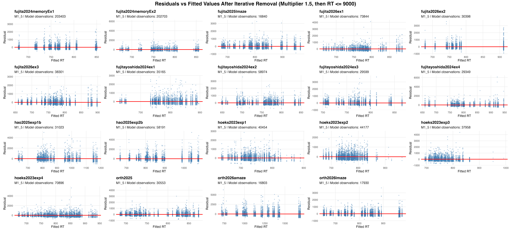

<style>
.main-container {
  max-width: 1400px;
}
table {
  font-size: 0.9em;
}
.table-scroll {
  overflow-x: auto;
  margin-bottom: 1.5em;
}
</style>

# Overview

This report documents the import, integrity checks, iterative reaction-time
(RT) cleaning, Box--Cox transformation, and distributional diagnostics used
for the maze datasets. The workflow preserves all unique experimental rows,
documents exact duplicate records separately, applies iterative relative RT
removal before the exploratory, post-hoc 9,000-ms cutoff, and generates the
tables and figures used for publication.

```{r setup, include=FALSE}
knitr::opts_chunk$set(
  echo = FALSE,
  message = FALSE,
  warning = FALSE,
  cache = TRUE,
  fig.align = "center",
  out.width = "100%"
)

library(dplyr)
library(ggplot2)
library(patchwork)

set.seed(123)

source("source_audit_helpers.R")
source("rt_process.R")

analysis_cache_files <- c(
  "rt_process.R",
  "source_audit_helpers.R",
  sort(list.files("data", pattern = "\\.csv$", full.names = TRUE))
)
analysis_cache_key <- paste(
  unname(tools::md5sum(analysis_cache_files)),
  collapse = ""
)
knitr::opts_chunk$set(
  cache = TRUE,
  cache.extra = analysis_cache_key
)
```

# Data import and integrity checks

All CSV files are imported with raw header repair disabled. A versioned,
deterministic normalization function then assigns unique analysis names while
preserving every raw header in the schema manifest. Exact duplicate
experimental records are identified before analysis; duplicate copies are
excluded while their source-row counts remain documented.

```{r import-data}
csv_files <- list.files(
  path = "data",
  pattern = "\\.csv$",
  full.names = TRUE
)

datasets <- lapply(csv_files, read_maze_csv)

dataset_names <- tools::file_path_sans_ext(basename(csv_files))
if (anyDuplicated(dataset_names)) {
  stop("Source CSV basenames must be unique.")
}
names(datasets) <- dataset_names

source_datasets <- datasets

source_manifests <- build_source_manifests(
  csv_files,
  source_datasets
)
source_data_manifest <- source_manifests$checksum
source_schema_manifest <- source_manifests$schema

write.csv(
  source_data_manifest,
  "source_data_manifest.csv",
  row.names = FALSE,
  na = ""
)
write.csv(
  source_schema_manifest,
  "source_schema_manifest.csv",
  row.names = FALSE,
  na = ""
)

stopifnot(
  nrow(source_data_manifest) == length(csv_files),
  all(nchar(source_data_manifest$SHA256) == 64L),
  all(nchar(source_data_manifest$HeaderSHA256) == 64L),
  all(source_schema_manifest$RawHeaderOccurrences >= 1L),
  !anyDuplicated(
    paste(
      source_schema_manifest$Dataset,
      source_schema_manifest$NormalizedHeader,
      sep = "\034"
    )
  )
)

knitr::kable(
  source_data_manifest,
  caption = paste0(
    "Source-data checksum, row-count, raw-header, and import manifest."
  ),
  format.args = list(big.mark = ",")
)

duplicate_header_schema <- source_schema_manifest[
  source_schema_manifest$RawHeaderOccurrences > 1L,
  ,
  drop = FALSE
]

knitr::kable(
  duplicate_header_schema,
  caption = paste0(
    "Explicit normalization of duplicate raw CSV headers. ",
    "Blank raw names are shown as <blank>."
  )
)

exact_duplicate_audit <- bind_rows(
  Map(
    f = function(dat, dataset_name) {
      experimental <-
        is_experimental_condition(dat$Condition)
      duplicate_copy <-
        experimental & duplicated(dat)

      data.frame(
        Dataset = dataset_name,
        SourceRows = nrow(dat),
        SourceExperimentalRows =
          sum(experimental),
        ExactDuplicateExperimentalCopies =
          sum(duplicate_copy),
        UniqueRowsRetained =
          nrow(dat) - sum(duplicate_copy),
        stringsAsFactors = FALSE
      )
    },
    dat = source_datasets,
    dataset_name = names(source_datasets)
  )
)

datasets <- lapply(
  source_datasets,
  function(dat) {
    experimental <-
      is_experimental_condition(dat$Condition)
    duplicate_copy <-
      experimental & duplicated(dat)

    dat[!duplicate_copy, , drop = FALSE]
  }
)

stopifnot(
  identical(names(datasets), names(source_datasets)),
  all(
    vapply(
      seq_along(datasets),
      function(index) {
        nrow(datasets[[index]]) ==
          exact_duplicate_audit$UniqueRowsRetained[[index]]
      },
      logical(1L)
    )
  )
)

knitr::kable(
  exact_duplicate_audit,
  caption = "Source-row and exact-duplicate audit.",
  format.args = list(big.mark = ",")
)

make_rt_plot <- function(dat, dataset_name = "Dataset") {

  if (!is.data.frame(dat)) {
    stop("dat must be an imported data frame.")
  }

  if (!"RT" %in% names(dat)) {
    return(
      ggplot() +
        annotate(
          "text",
          x = 0,
          y = 0,
          label = paste("Variable RT not found in", dataset_name)
        ) +
        xlim(-1, 1) +
        ylim(-1, 1) +
        theme_void() +
        labs(title = dataset_name)
    )
  }

  # Convert RT to numeric; non-numeric and non-finite values are removed
  rt <- suppressWarnings(as.numeric(as.character(dat$RT)))
  rt <- rt[is.finite(rt)]

  if (length(rt) == 0) {
    return(
      ggplot() +
        annotate(
          "text",
          x = 0,
          y = 0,
          label = "No numeric RT values"
        ) +
        xlim(-1, 1) +
        ylim(-1, 1) +
        theme_void() +
        labs(title = dataset_name)
    )
  }

  n_below_200 <- sum(rt < 200)
  n_above_5000 <- sum(rt > 5000)

  # Special handling when all RT values are identical
  if (length(unique(rt)) == 1) {
    hist_breaks <- seq(
      rt[1] - 0.5,
      rt[1] + 0.5,
      length.out = 31
    )
  } else {
    hist_breaks <- 30
  }

  # Calculate histogram values
  h <- hist(rt, breaks = hist_breaks, plot = FALSE)

  hist_data <- data.frame(
    midpoint = h$mids,
    count = h$counts,
    width = diff(h$breaks)
  )

  # Values for the fitted normal-distribution line
  rt_mean <- mean(rt)
  rt_sd <- sd(rt)

  if (is.finite(rt_sd) && rt_sd > 0) {
    normal_data <- data.frame(
      x = seq(
        min(h$breaks),
        max(h$breaks),
        length.out = 500
      )
    )

    # Scale the normal density to histogram counts
    normal_data$y <- dnorm(
      normal_data$x,
      mean = rt_mean,
      sd = rt_sd
    ) * length(rt) * median(hist_data$width)

  } else {
    normal_data <- NULL
  }

  p <- ggplot(hist_data, aes(x = midpoint, y = count)) +
    geom_col(
      aes(width = width),
      fill = "steelblue",
      color = "white",
      alpha = 0.8
    ) +
    geom_text(
      aes(label = ifelse(count > 0, count, "")),
      vjust = -0.3,
      size = 2.7
    ) +
    annotate(
      "label",
      x = Inf,
      y = Inf,
      label = paste0(
        "RT < 200: ", n_below_200,
        "\nRT > 5000: ", n_above_5000
      ),
      hjust = 1.05,
      vjust = 1.1,
      size = 3,
      linewidth = 0.2,
      fill = "white"
    ) +
    scale_y_continuous(
      expand = expansion(mult = c(0, 0.15))
    ) +
    labs(
      title = dataset_name,
      subtitle = paste0(
        "Numeric RTs: ", length(rt),
        " | Mean: ", round(rt_mean, 1),
        " | SD: ", round(rt_sd, 1)
      ),
      x = "RT",
      y = "Frequency"
    ) +
    theme_minimal(base_size = 10) +
    theme(
      plot.title = element_text(face = "bold"),
      panel.grid.minor = element_blank()
    )

  if (!is.null(normal_data)) {
    p <- p +
      geom_line(
        data = normal_data,
        aes(x = x, y = y),
        inherit.aes = FALSE,
        color = "red",
        linewidth = 0.9
      )
  }

  return(p)
}

make_rt_qq_plot <- function(dat, dataset_name = "Dataset") {
  if (!is.data.frame(dat)) {
    stop("dat must be an imported data frame.")
  }

  if (!"RT" %in% names(dat)) {
    return(
      ggplot() +
        annotate(
          "text",
          x = 0,
          y = 0,
          label = paste("Variable RT not found in", dataset_name)
        ) +
        xlim(-1, 1) +
        ylim(-1, 1) +
        theme_void() +
        labs(title = dataset_name)
    )
  }

  rt <- suppressWarnings(as.numeric(as.character(dat$RT)))
  rt <- rt[is.finite(rt)]

  if (length(rt) < 2L || length(unique(rt)) < 2L) {
    return(
      ggplot() +
        annotate(
          "text",
          x = 0,
          y = 0,
          label = "Not enough varying numeric RT values"
        ) +
        xlim(-1, 1) +
        ylim(-1, 1) +
        theme_void() +
        labs(title = dataset_name)
    )
  }

  max_points <- 5000L

  if (length(rt) <= max_points) {
    probabilities <- ppoints(length(rt))
    observed_quantiles <- sort(rt)
  } else {
    probabilities <- ppoints(max_points)
    observed_quantiles <- as.numeric(
      quantile(
        rt,
        probs = probabilities,
        names = FALSE,
        type = 8
      )
    )
  }

  qq_data <- data.frame(
    theoretical_quantiles = qnorm(probabilities),
    observed_quantiles = observed_quantiles
  )

  theoretical_quartiles <- qnorm(c(0.25, 0.75))
  observed_quartiles <- as.numeric(
    quantile(rt, probs = c(0.25, 0.75), names = FALSE)
  )
  reference_slope <-
    diff(observed_quartiles) / diff(theoretical_quartiles)
  reference_intercept <-
    observed_quartiles[1] -
    reference_slope * theoretical_quartiles[1]

  ggplot(
    qq_data,
    aes(
      x = theoretical_quantiles,
      y = observed_quantiles
    )
  ) +
    geom_point(
      color = "steelblue",
      alpha = 0.45,
      size = 0.6
    ) +
    geom_abline(
      intercept = reference_intercept,
      slope = reference_slope,
      color = "red",
      linewidth = 0.8
    ) +
    labs(
      title = dataset_name,
      subtitle = paste0("Numeric RTs: ", length(rt)),
      x = "Theoretical normal quantiles",
      y = "Observed RT quantiles"
    ) +
    theme_minimal(base_size = 10) +
    theme(
      plot.title = element_text(face = "bold"),
      panel.grid.minor = element_blank()
    )
}

```

# Iterative cleaning and session-level identifiers

Participant-session keys are constructed before cleaning so that complete
repeated sessions stored under one source identifier are treated as separate
analysis units. Iterative removal is evaluated independently within each
condition and region. Source run/session fields are used when present. When
they are absent, the audit records that metadata validation is unavailable;
only exact multiples of a unique modal experimental-row count are
reconstructed, and each inferred block must be contiguous and reproduce the
same condition--item--region trajectory as its companion block.

```{r iterative-cleaning}

analysis_subject_key_results <- Map(
  f = make_analysis_subject_key,
  dat = datasets,
  dataset_name = names(datasets)
)

datasets <- Map(
  f = function(dat, key_result) {
    dat$.AnalysisSubject <- key_result$key
    dat
  },
  dat = datasets,
  key_result = analysis_subject_key_results
)

analysis_session_audit <- bind_rows(
  Map(
    f = function(key_result, dataset_name) {
      data.frame(
        Dataset = dataset_name,
        SourceParticipantLabels =
          key_result$source_participants,
        AnalysisParticipants =
          key_result$analysis_participants,
        ModalExperimentalRowsPerSession =
          key_result$modal_rows,
        AdditionalCompleteSessions =
          key_result$additional_sessions,
        SessionConstruction =
          key_result$session_construction,
        SourceSessionMetadata =
          key_result$metadata_columns,
        MetadataValidation =
          key_result$metadata_validation,
        BoundaryValidation =
          key_result$boundary_validation,
        stringsAsFactors = FALSE
      )
    },
    key_result = analysis_subject_key_results,
    dataset_name = names(datasets)
  )
)

session_boundary_provenance <- bind_rows(
  lapply(
    analysis_subject_key_results,
    `[[`,
    "boundary_provenance"
  )
)

stopifnot(
  all(
    analysis_session_audit$MetadataValidation %in%
      c("PASS", "NOT_AVAILABLE")
  ),
  all(
    analysis_session_audit$BoundaryValidation %in%
      c("PASS", "REVIEW", "NOT_APPLICABLE")
  ),
  !any(grepl(
    "::session",
    unlist(session_boundary_provenance, use.names = FALSE),
    fixed = TRUE
  ))
)

write.csv(
  analysis_session_audit,
  "analysis_session_audit.csv",
  row.names = FALSE,
  na = ""
)
write.csv(
  session_boundary_provenance,
  "session_boundary_provenance.csv",
  row.names = FALSE,
  na = ""
)

knitr::kable(
  analysis_session_audit,
  caption = "Participant-label and analysis-session audit.",
  format.args = list(big.mark = ",")
)

if (nrow(session_boundary_provenance) > 0L) {
  knitr::kable(
    session_boundary_provenance,
    caption = paste0(
      "De-identified source-row provenance for reconstructed ",
      "session boundaries."
    ),
    format.args = list(big.mark = ",")
  )
}

# The focal RT must be strictly greater than this multiple of every relevant
# comparison value. Change this one value to use a different relative cutoff.
rt_multiplier <- 1.5

# Regression check: deliberately use the same participants, items, and regions
# in two conditions with very different RT patterns. Neither the within-
# participant nor the cross-participant comparison may cross conditions.
test_low_rt <- 100
test_high_rt <-
  test_low_rt * (rt_multiplier + 1)

condition_isolation_test <- tibble::tribble(
  ~Subject, ~Condition,     ~Item, ~Word, ~RT,
  "A",      "condition_a",  "1",   "1",   test_high_rt,
  "A",      "condition_a",  "2",   "1",   test_low_rt,
  "B",      "condition_a",  "1",   "1",   test_low_rt,
  "B",      "condition_a",  "2",   "1",   test_low_rt,
  "A",      "condition_b",  "1",   "1",   test_high_rt,
  "A",      "condition_b",  "2",   "1",   test_high_rt,
  "B",      "condition_b",  "1",   "1",   test_high_rt,
  "B",      "condition_b",  "2",   "1",   test_high_rt
) %>%
  mutate(.test_row = row_number())

condition_isolation_result <- .remove_iterative_rt_outliers_at_multiplier(
  condition_isolation_test,
  multiplier = rt_multiplier
)

condition_split_result <- lapply(
  split(
    seq_len(nrow(condition_isolation_test)),
    condition_isolation_test$Condition
  ),
  function(rows) {
    .remove_iterative_rt_outliers_at_multiplier(
      condition_isolation_test[rows, , drop = FALSE],
      multiplier = rt_multiplier
    )
  }
) %>%
  bind_rows() %>%
  arrange(.test_row)

condition_a_focal <- condition_isolation_result %>%
  filter(
    Subject == "A",
    Condition == "condition_a",
    Item == "1"
  )

condition_b_focal <- condition_isolation_result %>%
  filter(
    Subject == "A",
    Condition == "condition_b",
    Item == "1"
  )

stopifnot(
  nrow(condition_a_focal) == 0L,
  nrow(condition_b_focal) == 1L,
  identical(
    condition_isolation_result$.test_row,
    condition_split_result$.test_row
  ),
  identical(
    names(condition_isolation_result),
    names(condition_isolation_test)
  ),
  identical(
    sort(condition_isolation_result$.test_row),
    3:8
  )
)

# Duplicate rows at one subject/item cell use the cell maximum. Removing the
# largest qualifying duplicate exposes the next duplicate; after both are
# removed, the last item for that participant becomes unevaluable and is
# removed on the next iteration.
duplicate_cascade_test <- tibble::tribble(
  ~Subject, ~Condition, ~Item, ~Word, ~RT,
  "A",      "target",   "1",   "1",   test_high_rt * 1.5,
  "A",      "target",   "1",   "1",   test_high_rt,
  "A",      "target",   "2",   "1",   test_low_rt,
  "B",      "target",   "1",   "1",   test_low_rt,
  "B",      "target",   "2",   "1",   test_low_rt
)

duplicate_cascade_result <-
  .remove_iterative_rt_outliers_at_multiplier(
    duplicate_cascade_test,
    multiplier = rt_multiplier
  )

stopifnot(
  nrow(duplicate_cascade_result) == 2L,
  all(duplicate_cascade_result$Subject == "B"),
  identical(
    names(duplicate_cascade_result),
    names(duplicate_cascade_test)
  )
)

rm(
  condition_isolation_test,
  condition_isolation_result,
  condition_split_result,
  condition_a_focal,
  condition_b_focal,
  duplicate_cascade_test,
  duplicate_cascade_result,
  test_low_rt,
  test_high_rt
)
```

Apply the largest-first iterative procedure to the list of datasets. After each
removal, comparison maxima are recomputed within the same dataset, analysis
condition, and region. Iteration stops only when no remaining RT satisfies the
removal rule.

```{r iterative-stage-analysis}
comparison_keys_for_dataset <- function(dat, dataset_name) {
  condition_key <- dat$Condition
  item_key <- dat$Item
  word_key <- dat$Word

  # These files label ca1-ca4 as Item and the actual item number as
  # Condition. Swap only the comparison keys; preserve the source columns.
  if (dataset_name %in% c(
    "fujita2026ex1",
    "fujita2026ex2",
    "fujita2026ex3"
  )) {
    condition_key <- dat$Item
    item_key <- dat$Condition
  }

  # In these PCIbex exports, Condition includes the item number
  # (for example, target_n_g_145). Remove that suffix so other items from the
  # same experimental condition are comparable.
  if (dataset_name %in% c(
    "hoeks2023exp1",
    "hoeks2023exp2",
    "hoeks2023exp3"
  )) {
    condition_key <- sub(
      "_[0-9]+$",
      "",
      as.character(dat$Condition)
    )
  }

  # This file stores region position in WordNo; Word contains the word itself.
  if (dataset_name == "hoeks2023exp4") {
    if (!"WordNo" %in% names(dat)) {
      stop("hoeks2023exp4 is missing the required WordNo region column.")
    }
    word_key <- dat$WordNo
  }

  list(
    condition = condition_key,
    item = item_key,
    word = word_key
  )
}

remove_from_datasets <- function(multiplier) {
  Map(
    f = function(dat, dataset_name) {
      keys <- comparison_keys_for_dataset(dat, dataset_name)
      .remove_iterative_rt_outliers_at_multiplier(
        data = dat,
        subject = dat$.AnalysisSubject,
        condition = keys$condition,
        item = keys$item,
        region = keys$word,
        rt = dat$RT,
        eligible =
          is_experimental_condition(dat$Condition),
        multiplier = multiplier,
        remove_no_comparator = TRUE
      )
    },
    dat = datasets,
    dataset_name = names(datasets)
  )
}

iterative_datasets_m1_5 <- remove_from_datasets(1.5)

# All report figures use the historical fixed-multiplier illustration. These
# settings are explicit because neither is a public-function default.
benchmark_remove_no_comparator <- TRUE
benchmark_rt_cutoff_ms <- 9000

# All report figures use the fixed multiplier-1.5 sensitivity result.
clean_datasets <- iterative_datasets_m1_5

stopifnot(
  identical(names(clean_datasets), names(datasets)),
  all(vapply(
    seq_along(clean_datasets),
    function(i) {
      clean <- clean_datasets[[i]]
      original <- datasets[[i]]
      identical(names(clean), names(original)) &&
        nrow(clean) <= nrow(original)
    },
    logical(1)
  ))
)

# The source files contain different study-specific columns and types.
# Standardize only the shared columns when combining the cleaned datasets.
clean_data <- Map(
  f = function(dat, dataset_name) {
    dat |>
      transmute(
        Dataset = dataset_name,
        Subject = as.character(Subject),
        AnalysisSubject =
          as.character(.AnalysisSubject),
        Condition = as.character(Condition),
        Item = as.character(Item),
        Word = as.character(Word),
        RT = as.numeric(RT)
      )
  },
  dat = clean_datasets,
  dataset_name = names(clean_datasets)
) |>
  bind_rows()

# Use experimental rows at all three stages. In this illustration, RTs above
# the explicitly requested 9,000-ms ceiling are removed only after iterative
# removal.
raw_experimental_datasets <- lapply(
  datasets,
  function(dat) {
    experimental_rows <-
      is_experimental_condition(dat$Condition)

    dat[experimental_rows, , drop = FALSE]
  }
)

raw_experimental_row_audit <- bind_rows(
  Map(
    f = function(dat, raw_dat, dataset_name) {
      expected_rows <-
        is_experimental_condition(dat$Condition)
      rt_numeric <- suppressWarnings(
        as.numeric(as.character(raw_dat$RT))
      )
      subjects <- as.character(
        raw_dat$.AnalysisSubject
      )
      valid_subject <-
        !is.na(subjects) &
        nzchar(trimws(subjects))
      rows_by_participant <- table(
        subjects[valid_subject]
      )

      stopifnot(
        nrow(raw_dat) == sum(expected_rows),
        identical(
          raw_dat,
          dat[expected_rows, , drop = FALSE]
        )
      )

      data.frame(
        Dataset = dataset_name,
        SourceExperimentalRows =
          exact_duplicate_audit$SourceExperimentalRows[
            match(
              dataset_name,
              exact_duplicate_audit$Dataset
            )
          ],
        ExactDuplicateExperimentalCopies =
          exact_duplicate_audit$
            ExactDuplicateExperimentalCopies[
              match(
                dataset_name,
                exact_duplicate_audit$Dataset
              )
            ],
        Participants = length(rows_by_participant),
        RawExperimentalRows = nrow(raw_dat),
        NumericRTs = sum(is.finite(rt_numeric)),
        NonNumericRTSlots =
          sum(!is.finite(rt_numeric)),
        MinimumRowsPerParticipant =
          if (length(rows_by_participant) > 0L) {
            min(rows_by_participant)
          } else {
            NA_integer_
          },
        MedianRowsPerParticipant =
          if (length(rows_by_participant) > 0L) {
            median(rows_by_participant)
          } else {
            NA_real_
          },
        MaximumRowsPerParticipant =
          if (length(rows_by_participant) > 0L) {
            max(rows_by_participant)
          } else {
            NA_integer_
          },
        BalancedRowsPerParticipant =
          length(rows_by_participant) > 0L &&
          length(unique(
            as.integer(rows_by_participant)
          )) == 1L,
        stringsAsFactors = FALSE
      )
    },
    dat = datasets,
    raw_dat = raw_experimental_datasets,
    dataset_name = names(datasets)
  )
)

knitr::kable(
  raw_experimental_row_audit,
  caption = "Raw experimental-row audit before RT processing.",
  format.args = list(big.mark = ",")
)

prepare_iterative_stage <- function(dataset_list) {
  lapply(
    dataset_list,
    function(dat) {
      rt_numeric <- suppressWarnings(
        as.numeric(as.character(dat$RT))
      )

      dat |>
        filter(
          is_experimental_condition(Condition),
          is.finite(rt_numeric),
          rt_numeric <= benchmark_rt_cutoff_ms
        )
    }
  )
}

iterative_experimental_m1_5 <-
  prepare_iterative_stage(iterative_datasets_m1_5)

clean_experimental_datasets <- iterative_experimental_m1_5
```

# Cleaned reaction-time distributions

These panels show experimental RTs after multiplier-1.5 iterative removal and
the subsequent 9,000-ms cutoff.

```{r cleaned-distribution-figures, fig.cap=c("RT distributions after multiplier-1.5 iterative removal and the 9,000-ms cutoff.", "Normal Q--Q plots after multiplier-1.5 iterative removal and the 9,000-ms cutoff.")}

plot_list <- Map(
  f = make_rt_plot,
  dat = clean_experimental_datasets,
  dataset_name = names(clean_experimental_datasets)
)

combined_figure <- wrap_plots(plot_list, ncol = 5) +
  plot_annotation(
    title = "RT Distributions Across Cleaned Experimental Items",
    theme = theme(
      plot.title = element_text(
        size = 16,
        face = "bold",
        hjust = 0.5
      )
    )
  )
ggsave(
  filename = "RT_histograms_all_datasets_m1_5.png",
  plot = combined_figure,
  width = 22,#max(8, ceiling(length(plot_list) / 2) * 3),
  height = 10,
  units = "in",
  dpi = 300,
  limitsize = FALSE
)

qq_plot_list <- Map(
  f = make_rt_qq_plot,
  dat = clean_experimental_datasets,
  dataset_name = names(clean_experimental_datasets)
)

qq_combined_figure <- wrap_plots(qq_plot_list, ncol = 5) +
  plot_annotation(
    title = "Normal Q-Q Plots Across Cleaned Experimental Items",
    theme = theme(
      plot.title = element_text(
        size = 16,
        face = "bold",
        hjust = 0.5
      )
    )
  )

ggsave(
  filename = "RT_QQ_plots_all_datasets_m1_5.png",
  plot = qq_combined_figure,
  width = 22,
  height = 10,
  units = "in",
  dpi = 300,
  limitsize = FALSE
)

knitr::include_graphics(
  c(
    "RT_histograms_all_datasets_m1_5.png",
    "RT_QQ_plots_all_datasets_m1_5.png"
  )
)
```


# Xapd distribution-shape functions

The validated Xapd component and omnibus-test functions are loaded from the
standalone `rt_process.R` implementation used by this report. Because the
trial-level observations are crossed repeated measures, the resulting
p-values are retained only as descriptive reference calculations; they are
not used to accept or reject a model assumption.

```{r verify-xapd-functions, include=FALSE}
# These validated standalone implementations are loaded from
# rt_process.R above.
stopifnot(
  all(
    vapply(
      c(
        "B2",
        "K2",
        "Z.B2",
        "Z.net.K2",
        "Xapd.test"
      ),
      exists,
      logical(1L),
      mode = "function",
      inherits = TRUE
    )
  )
)
```


# Residual-versus-fitted plots and summary diagnostics

The same additive screening model is fitted separately to each dataset and
stage:

\[
\mathrm{RT} \sim \mathrm{Condition} + \mathrm{factor(Word)}.
\]

The dataset-specific analysis-condition and region mappings are used. The raw
stage includes experimental rows without the 9,000-ms cutoff. For multiplier
1.5, iterative removal is applied first and RTs above 9,000 ms are then
removed, preserving the existing order of operations.

Xapd is calculated on each stage's marginal finite RT distribution and is
interpreted descriptively as a distribution-shape summary. Box–Cox lambda and
the residual-versus-fitted plots are calculated from the additive screening
model; finite nonpositive RTs are excluded from those two model-based
diagnostics because Box–Cox requires a positive response. This screening model
is not a reconstruction of each study's final inferential model. Normality,
constant variance, and influence must be evaluated from the conditional
residuals and leave-one-cluster fits of the final model, including its planned
fixed and random effects.

```{r diagnostic-summaries-setup}
analyze_rt_stage <- function(
  dat,
  raw_dat,
  dataset_name,
  stage_name,
  max_plot_points = 5000L
) {
  keys <- comparison_keys_for_dataset(dat, dataset_name)
  rt <- suppressWarnings(as.numeric(as.character(dat$RT)))
  raw_rt <- suppressWarnings(
    as.numeric(as.character(raw_dat$RT))
  )

  finite_rt <- rt[is.finite(rt)]
  finite_raw_rt <- raw_rt[is.finite(raw_rt)]
  finite_subjects <- as.character(
    dat$.AnalysisSubject[is.finite(rt)]
  )
  finite_subjects <- finite_subjects[
    !is.na(finite_subjects) & finite_subjects != ""
  ]
  raw_subjects <- as.character(
    raw_dat$.AnalysisSubject
  )
  raw_subjects <- raw_subjects[
    !is.na(raw_subjects) & raw_subjects != ""
  ]
  rt_200_to_5000_removed <-
    sum(finite_raw_rt >= 200 & finite_raw_rt <= 5000) -
    sum(finite_rt >= 200 & finite_rt <= 5000)
  model_rows <-
    is.finite(rt) &
    rt > 0 &
    !is.na(keys$condition) &
    !is.na(keys$word)

  model_data <- data.frame(
    RT = rt[model_rows],
    Condition = factor(
      as.character(keys$condition[model_rows])
    ),
    Word = factor(
      as.character(keys$word[model_rows])
    )
  )

  if (
    nrow(model_data) < 3L ||
    nlevels(model_data$Condition) < 2L ||
    nlevels(model_data$Word) < 2L
  ) {
    stop(
      dataset_name,
      " at stage ",
      stage_name,
      " does not have enough condition-region variation ",
      "for RT ~ Condition + factor(Word)."
    )
  }

  model <- lm(
    RT ~ Condition + Word,
    data = model_data,
    y = TRUE
  )

  model_diagnostics <- data.frame(
    Fitted = fitted(model),
    Residual = residuals(model)
  )

  if (nrow(model_diagnostics) > max_plot_points) {
    plot_rows <- sample.int(
      nrow(model_diagnostics),
      max_plot_points
    )
    model_diagnostics <- model_diagnostics[
      plot_rows,
      ,
      drop = FALSE
    ]
  }

  residual_plot <- ggplot(
    model_diagnostics,
    aes(x = Fitted, y = Residual)
  ) +
    geom_point(
      color = "steelblue",
      alpha = 0.35,
      size = 0.6
    ) +
    geom_hline(
      yintercept = 0,
      color = "red",
      linewidth = 0.8
    ) +
    labs(
      title = dataset_name,
      subtitle = paste0(
        stage_name,
        " | Model observations: ",
        nrow(model_data)
      ),
      x = "Fitted RT",
      y = "Residual"
    ) +
    theme_minimal(base_size = 10) +
    theme(
      plot.title = element_text(face = "bold"),
      panel.grid.minor = element_blank()
    )

  xapd <- suppressWarnings(Xapd.test(finite_rt))
  box_cox <- suppressWarnings(
    MASS::boxcox(
      model,
      lambda = seq(-2, 2, by = 0.1),
      plotit = FALSE
    )
  )
  box_cox_lambda <-
    box_cox$x[which.max(box_cox$y)]

  summary <- data.frame(
    Dataset = dataset_name,
    Stage = stage_name,
    Participants = length(unique(raw_subjects)),
    StageParticipants =
      length(unique(finite_subjects)),
    RawExperimentalRows = nrow(raw_dat),
    NumericRTs = length(finite_rt),
    RTBelow200 = sum(finite_rt < 200),
    RTAbove5000 = sum(finite_rt > 5000),
    RT200to5000Removed = rt_200_to_5000_removed,
    Xapd_Z_B2 = xapd$Z.B2,
    Xapd_Z_net_K2 = xapd$Z.net.K2,
    Xapd_Statistic = xapd$stat,
    Xapd_PValue = xapd$p.value,
    BoxCoxLambda = box_cox_lambda,
    stringsAsFactors = FALSE
  )

  list(
    residual_data = model_diagnostics,
    summary = summary,
    residual_plot = residual_plot
  )
}

diagnostic_stage_datasets <- list(
  Raw = raw_experimental_datasets,
  M1_5 = iterative_experimental_m1_5
)

diagnostic_run_grid <- expand.grid(
  Stage = names(diagnostic_stage_datasets),
  Dataset = names(datasets),
  KEEP.OUT.ATTRS = FALSE,
  stringsAsFactors = FALSE
)
diagnostic_batch_boundaries <- unique(as.integer(round(
  seq(0, nrow(diagnostic_run_grid), length.out = 5L)
)))
run_diagnostic_batch <- function(first, last) {
  run_indices <- seq.int(first, last)
  lapply(
    run_indices,
    function(run_index) {
      stage_name <- diagnostic_run_grid$Stage[[run_index]]
      dataset_name <- diagnostic_run_grid$Dataset[[run_index]]
      stage_datasets <-
        diagnostic_stage_datasets[[stage_name]]
      analyze_rt_stage(
        dat = stage_datasets[[dataset_name]],
        raw_dat = raw_experimental_datasets[[dataset_name]],
        dataset_name = dataset_name,
        stage_name = stage_name
      )
    }
  )
}
```

```{r diagnostic-summaries-1, cache.extra=paste0(analysis_cache_key, "-diagnostic-v2")}
diagnostic_results_flat_1 <- run_diagnostic_batch(
  diagnostic_batch_boundaries[[1L]] + 1L,
  diagnostic_batch_boundaries[[2L]]
)
```

```{r diagnostic-summaries-2, cache.extra=paste0(analysis_cache_key, "-diagnostic-v2")}
diagnostic_results_flat_2 <- run_diagnostic_batch(
  diagnostic_batch_boundaries[[2L]] + 1L,
  diagnostic_batch_boundaries[[3L]]
)
```

```{r diagnostic-summaries-3, cache.extra=paste0(analysis_cache_key, "-diagnostic-v2")}
diagnostic_results_flat_3 <- run_diagnostic_batch(
  diagnostic_batch_boundaries[[3L]] + 1L,
  diagnostic_batch_boundaries[[4L]]
)
```

```{r diagnostic-summaries-4, cache.extra=paste0(analysis_cache_key, "-diagnostic-v2")}
diagnostic_results_flat_4 <- run_diagnostic_batch(
  diagnostic_batch_boundaries[[4L]] + 1L,
  diagnostic_batch_boundaries[[5L]]
)
```

```{r diagnostic-summaries-combine}
diagnostic_results_flat <- c(
  diagnostic_results_flat_1,
  diagnostic_results_flat_2,
  diagnostic_results_flat_3,
  diagnostic_results_flat_4
)
diagnostic_results <- lapply(
  names(diagnostic_stage_datasets),
  function(stage_name) {
    stage_results <- diagnostic_results_flat[
      diagnostic_run_grid$Stage == stage_name
    ]
    names(stage_results) <- diagnostic_run_grid$Dataset[
      diagnostic_run_grid$Stage == stage_name
    ]
    stage_results
  }
)
names(diagnostic_results) <-
  names(diagnostic_stage_datasets)

diagnostic_summary_long <- bind_rows(
  lapply(
    diagnostic_results,
    function(stage_results) {
      bind_rows(lapply(stage_results, `[[`, "summary"))
    }
  )
)

diagnostic_summary_table <- reshape(
  as.data.frame(diagnostic_summary_long),
  idvar = "Dataset",
  timevar = "Stage",
  direction = "wide"
)

names(diagnostic_summary_table) <- gsub(
  "\\.",
  "_",
  names(diagnostic_summary_table)
)

diagnostic_summary_table <-
  diagnostic_summary_table[
    match(
      names(datasets),
      diagnostic_summary_table$Dataset
    ),
    ,
    drop = FALSE
  ]

rownames(diagnostic_summary_table) <- NULL

diagnostic_summary_display <-
  diagnostic_summary_long |>
  dplyr::select(
    Dataset,
    Stage,
    Participants,
    RawExperimentalRows,
    NumericRTs,
    RT200to5000Removed,
    Xapd_Z_B2,
    Xapd_Z_net_K2,
    Xapd_Statistic,
    Xapd_PValue,
    BoxCoxLambda
  )

knitr::kable(
  diagnostic_summary_display,
  digits = 2,
  caption = paste0(
    "RT counts, iterative-removal totals, descriptive Xapd shape ",
    "diagnostics, ",
    "and Box--Cox estimates by dataset and stage."
  ),
  format.args = list(big.mark = ",")
)
```

```{r residual-diagnostic-figures, fig.cap="Residuals versus fitted values after multiplier-1.5 iterative removal and the 9,000-ms cutoff."}
make_residual_figure <- function(stage_results, title) {
  plots <- lapply(
    stage_results,
    `[[`,
    "residual_plot"
  )

  wrap_plots(plots, ncol = 5) +
    plot_annotation(
      title = title,
      theme = theme(
        plot.title = element_text(
          size = 16,
          face = "bold",
          hjust = 0.5
        )
      )
    )
}

residual_figure_m1_5 <- make_residual_figure(
  diagnostic_results$M1_5,
  paste0(
    "Residuals vs Fitted Values After Iterative Removal ",
    "(Multiplier 1.5, then RT <= 9000)"
  )
)

ggsave(
  filename = "RT_residuals_vs_fitted_iterative_m1_5.png",
  plot = residual_figure_m1_5,
  width = 22,
  height = 10,
  units = "in",
  dpi = 300,
  limitsize = FALSE
)


```


# Box–Cox-transformed multiplier-1.5 screening diagnostics

Each multiplier-1.5 dataset is transformed using its own optimal Box–Cox lambda
from `diagnostic_summary_table`. For lambda zero, the transformation is
\(\log(\mathrm{RT})\); otherwise it is
\((\mathrm{RT}^{\lambda} - 1) / \lambda\). Box–Cox is defined only for positive
RTs, so finite nonpositive values are represented as missing in `RT_BoxCox` and
are excluded from these plots and models.

```{r boxcox-diagnostic-figures, fig.cap=c("Normal Q--Q plots for multiplier-1.5 Box--Cox-transformed RTs.", "Residuals versus fitted values for multiplier-1.5 Box--Cox-transformed RTs.")}
box_cox_transform <- function(x, lambda) {
  transformed <- rep(NA_real_, length(x))
  valid <- is.finite(x) & x > 0

  if (abs(lambda) < sqrt(.Machine$double.eps)) {
    transformed[valid] <- log(x[valid])
  } else {
    transformed[valid] <-
      (x[valid]^lambda - 1) / lambda
  }

  transformed
}

m1_5_box_cox_lambdas <- vapply(
  diagnostic_results$M1_5,
  function(result) {
    result$summary$BoxCoxLambda[[1L]]
  },
  numeric(1L)
)

boxcox_transformed_m1_5_datasets <- Map(
  f = function(dat, lambda) {
    rt <- suppressWarnings(
      as.numeric(as.character(dat$RT))
    )
    dat$RT_BoxCox <- box_cox_transform(rt, lambda)
    dat
  },
  dat = iterative_experimental_m1_5,
  lambda = m1_5_box_cox_lambdas
)
names(boxcox_transformed_m1_5_datasets) <-
  names(iterative_experimental_m1_5)

make_boxcox_m1_5_diagnostics <- function(
  dat,
  dataset_name,
  lambda,
  max_plot_points = 5000L
) {
  keys <- comparison_keys_for_dataset(dat, dataset_name)
  transformed_rt <- dat$RT_BoxCox
  model_rows <-
    is.finite(transformed_rt) &
    !is.na(keys$condition) &
    !is.na(keys$word)

  model_data <- data.frame(
    RT_BoxCox = transformed_rt[model_rows],
    Condition = factor(
      as.character(keys$condition[model_rows])
    ),
    Word = factor(
      as.character(keys$word[model_rows])
    )
  )

  if (
    nrow(model_data) < 3L ||
    nlevels(model_data$Condition) < 2L ||
    nlevels(model_data$Word) < 2L
  ) {
    stop(
      dataset_name,
      " does not have enough condition-region variation ",
      "for the Box-Cox-transformed multiplier-1.5 model."
    )
  }

  model <- lm(
    RT_BoxCox ~ Condition + Word,
    data = model_data
  )

  residual_data <- data.frame(
    Fitted = fitted(model),
    Residual = residuals(model)
  )

  if (nrow(residual_data) > max_plot_points) {
    plot_rows <- sample.int(
      nrow(residual_data),
      max_plot_points
    )
    residual_data <- residual_data[
      plot_rows,
      ,
      drop = FALSE
    ]
  }

  qq_plot <- make_rt_qq_plot(
    data.frame(RT = transformed_rt),
    dataset_name = dataset_name
  ) +
    labs(
      subtitle = paste0(
        "Multiplier-1.5 Box-Cox lambda = ",
        format(lambda, nsmall = 1),
        " | Positive RTs: ",
        sum(is.finite(transformed_rt))
      ),
      y = "Transformed RT quantiles"
    )

  residual_plot <- ggplot(
    residual_data,
    aes(x = Fitted, y = Residual)
  ) +
    geom_point(
      color = "steelblue",
      alpha = 0.35,
      size = 0.6
    ) +
    geom_hline(
      yintercept = 0,
      color = "red",
      linewidth = 0.8
    ) +
    labs(
      title = dataset_name,
      subtitle = paste0(
        "Multiplier-1.5 Box-Cox lambda = ",
        format(lambda, nsmall = 1),
        " | Model observations: ",
        nrow(model_data)
      ),
      x = "Fitted Box-Cox-transformed RT",
      y = "Residual"
    ) +
    theme_minimal(base_size = 10) +
    theme(
      plot.title = element_text(face = "bold"),
      panel.grid.minor = element_blank()
    )

  list(
    residual_data = residual_data,
    qq_plot = qq_plot,
    residual_plot = residual_plot
  )
}

boxcox_m1_5_diagnostic_results <- lapply(
  seq_along(boxcox_transformed_m1_5_datasets),
  function(dataset_index) {
    dataset_name <-
      names(boxcox_transformed_m1_5_datasets)[[dataset_index]]
    make_boxcox_m1_5_diagnostics(
      dat =
        boxcox_transformed_m1_5_datasets[[dataset_index]],
      dataset_name = dataset_name,
      lambda = m1_5_box_cox_lambdas[[dataset_index]]
    )
  }
)
names(boxcox_m1_5_diagnostic_results) <-
  names(boxcox_transformed_m1_5_datasets)

boxcox_m1_5_qq_figure <- wrap_plots(
  lapply(boxcox_m1_5_diagnostic_results, `[[`, "qq_plot"),
  ncol = 5
) +
  plot_annotation(
    title = paste0(
      "Normal Q-Q Plots After Dataset-Specific Box-Cox ",
      "Transformation of Multiplier-1.5 RTs"
    ),
    theme = theme(
      plot.title = element_text(
        size = 16,
        face = "bold",
        hjust = 0.5
      )
    )
  )

boxcox_m1_5_residual_figure <- wrap_plots(
  lapply(
    boxcox_m1_5_diagnostic_results,
    `[[`,
    "residual_plot"
  ),
  ncol = 5
) +
  plot_annotation(
    title = paste0(
      "Residuals vs Fitted Values After Dataset-Specific ",
      "Box-Cox Transformation of Multiplier-1.5 RTs"
    ),
    theme = theme(
      plot.title = element_text(
        size = 16,
        face = "bold",
        hjust = 0.5
      )
    )
  )

ggsave(
  filename = "RT_QQ_plots_boxcox_m1_5.png",
  plot = boxcox_m1_5_qq_figure,
  width = 22,
  height = 10,
  units = "in",
  dpi = 300,
  limitsize = FALSE
)

ggsave(
  filename = "RT_residuals_vs_fitted_boxcox_m1_5.png",
  plot = boxcox_m1_5_residual_figure,
  width = 22,
  height = 10,
  units = "in",
  dpi = 300,
  limitsize = FALSE
)

knitr::include_graphics(
  c(
    "RT_QQ_plots_boxcox_m1_5.png",
    "RT_residuals_vs_fitted_boxcox_m1_5.png"
  )
)
```


# Publication table and raw-versus-Box–Cox comparison figures

For direct comparison in the figures, Q–Q values, fitted values, and residuals
are standardized separately within each dataset and stage. This preserves
within-stage distributional shape and relative variance patterns, but it does
not compare absolute residual variance across the two response scales. All
residual panels use the same standardized display window, defined by the
pooled 0.5th and 99.5th percentiles. The EPS output uses the exact dimensions
of landscape A4 paper (11.69 by 8.27 inches). The residual panels remain
screening plots from the additive condition-and-region model; inferential
assumptions must be checked on the final study-specific model residuals.

```{r publication-output-definitions}
publication_dataset_labels <- c(
  fujita2024memoryEx1 = "Fujita (2024), Memory Exp. 1",
  fujita2024memoryEx2 = "Fujita (2024), Memory Exp. 2",
  fujita2025lmaze = "Fujita (2025), L-Maze",
  fujita2026ex1 = "Fujita (2026), Exp. 1",
  fujita2026ex2 = "Fujita (2026), Exp. 2",
  fujita2026ex3 = "Fujita (2026), Exp. 3",
  fujitayoshida2024ex1 =
    "Fujita and Yoshida (2024), Exp. 1",
  fujitayoshida2024ex2 =
    "Fujita and Yoshida (2024), Exp. 2",
  fujitayoshida2024ex3 =
    "Fujita and Yoshida (2024), Exp. 3",
  fujitayoshida2024ex4 =
    "Fujita and Yoshida (2024), Exp. 4",
  hao2025exp1b = "Hao (2025), Exp. 1b",
  hao2025exp2b = "Hao (2025), Exp. 2b",
  hoeks2023exp1 = "Hoeks (2023), Exp. 1",
  hoeks2023exp2 = "Hoeks (2023), Exp. 2",
  hoeks2023exp3 = "Hoeks (2023), Exp. 3",
  hoeks2023exp4 = "Hoeks (2023), Exp. 4",
  orth2025 = "Orth (2025)",
  orth2026amaze = "Orth (2026), A-Maze",
  orth2026lmaze = "Orth (2026), L-Maze"
)

if (!identical(names(datasets), names(publication_dataset_labels))) {
  stop(
    "Publication dataset labels do not match the imported datasets."
  )
}

run_adaptive_rt_process <- function(
  dat,
  dataset_name,
  remove_no_comparator,
  rt_cutoff_ms
) {
  keys <- comparison_keys_for_dataset(dat, dataset_name)
  plot_file <- tempfile(fileext = ".pdf")
  grDevices::pdf(plot_file)
  plot_device <- grDevices::dev.cur()

  on.exit(
    {
      if (grDevices::dev.cur() == plot_device) {
        grDevices::dev.off()
      }
      unlink(plot_file)
    },
    add = TRUE
  )

  processed <- NULL
  invisible(
    capture.output(
      processed <- rt_process(
        data = dat,
        subject = dat$.AnalysisSubject,
        condition = keys$condition,
        item = keys$item,
        region = keys$word,
        rt = dat$RT,
        eligible =
          is_experimental_condition(dat$Condition),
        remove_no_comparator = remove_no_comparator,
        rt_cutoff_ms = rt_cutoff_ms
      )
    )
  )

  attr(processed, "rt_process_report")
}
```

```{r adaptive-report-generation-setup}
policy_run_grid <- expand.grid(
  DatasetIndex = seq_along(datasets),
  RemoveNoComparator = c(TRUE, FALSE),
  KEEP.OUT.ATTRS = FALSE,
  stringsAsFactors = FALSE
)

policy_batch_boundaries <- unique(as.integer(round(
  seq(0, nrow(policy_run_grid), length.out = 5L)
)))

run_policy_batch <- function(first, last) {
  run_indices <- seq.int(first, last)
  lapply(
    run_indices,
    function(run_index) {
      dataset_index <-
        policy_run_grid$DatasetIndex[[run_index]]
      run_adaptive_rt_process(
        dat = datasets[[dataset_index]],
        dataset_name = names(datasets)[[dataset_index]],
        remove_no_comparator =
          policy_run_grid$RemoveNoComparator[[run_index]],
        rt_cutoff_ms = benchmark_rt_cutoff_ms
      )
    }
  )
}
```

```{r adaptive-report-generation-1, cache=TRUE, cache.extra=analysis_cache_key}
all_policy_reports_1 <- run_policy_batch(
  policy_batch_boundaries[[1L]] + 1L,
  policy_batch_boundaries[[2L]]
)
```

```{r adaptive-report-generation-2, cache=TRUE, cache.extra=analysis_cache_key}
all_policy_reports_2 <- run_policy_batch(
  policy_batch_boundaries[[2L]] + 1L,
  policy_batch_boundaries[[3L]]
)
```

```{r adaptive-report-generation-3, cache=TRUE, cache.extra=analysis_cache_key}
all_policy_reports_3 <- run_policy_batch(
  policy_batch_boundaries[[3L]] + 1L,
  policy_batch_boundaries[[4L]]
)
```

```{r adaptive-report-generation-4, cache=TRUE, cache.extra=analysis_cache_key}
all_policy_reports_4 <- run_policy_batch(
  policy_batch_boundaries[[4L]] + 1L,
  policy_batch_boundaries[[5L]]
)
```

```{r adaptive-report-generation-combine}
all_policy_reports <- c(
  all_policy_reports_1,
  all_policy_reports_2,
  all_policy_reports_3,
  all_policy_reports_4
)
adaptive_rt_reports <- all_policy_reports[
  policy_run_grid$RemoveNoComparator
]
names(adaptive_rt_reports) <- names(datasets)
no_comparator_retention_reports <- all_policy_reports[
  !policy_run_grid$RemoveNoComparator
]
names(no_comparator_retention_reports) <- names(datasets)
```

```{r structural-sensitivity-generation}
removal_reason_count <- function(report, reason) {
  counts <- report$iterative_removal_reason_counts
  if (!reason %in% names(counts)) {
    return(0L)
  }
  as.integer(counts[[reason]])
}

clean_observation_count <- function(report) {
  as.integer(
    report$post_boxcox_diagnostics$
      numerical_integrity$observations
  )
}

compare_clean_model_coefficients <- function(
  primary,
  alternative
) {
  primary_coefficients <- primary$clean_model_coefficients
  alternative_coefficients <- alternative$clean_model_coefficients
  comparison <- merge(
    primary_coefficients,
    alternative_coefficients,
    by = "Term",
    suffixes = c("Primary", "Alternative")
  )
  comparison <- comparison[
    comparison$Term != "(Intercept)",
    ,
    drop = FALSE
  ]

  if (nrow(comparison) == 0L) {
    return(
      c(
        MaximumCoefficientShiftMs = NA_real_,
        MaximumStandardizedShift = NA_real_,
        CoefficientSignChanges = NA_integer_
      )
    )
  }

  coefficient_shift <-
    comparison$EstimateAlternative -
    comparison$EstimatePrimary
  standardized_shift <- abs(coefficient_shift) /
    comparison$StandardErrorPrimary
  sign_changes <- sum(
    sign(comparison$EstimatePrimary) !=
      sign(comparison$EstimateAlternative)
  )

  c(
    MaximumCoefficientShiftMs =
      max(abs(coefficient_shift), na.rm = TRUE),
    MaximumStandardizedShift =
      max(standardized_shift, na.rm = TRUE),
    CoefficientSignChanges = sign_changes
  )
}

no_comparator_sensitivity <- bind_rows(
  Map(
    f = function(primary, retained, dataset_name) {
      coefficient_sensitivity <-
        compare_clean_model_coefficients(primary, retained)
      data.frame(
        Dataset = dataset_name,
        PrimaryNoComparatorRemoved = removal_reason_count(
          primary,
          "no_other_item_comparison"
        ),
        RetentionNoComparatorRemoved = removal_reason_count(
          retained,
          "no_other_item_comparison"
        ),
        PrimaryParticipantAndItemRemoved = removal_reason_count(
          primary,
          "participant_and_item_ratio"
        ),
        RetentionParticipantAndItemRemoved = removal_reason_count(
          retained,
          "participant_and_item_ratio"
        ),
        PrimaryParticipantOnlyRemoved = removal_reason_count(
          primary,
          "participant_ratio_no_other_participant"
        ),
        RetentionParticipantOnlyRemoved = removal_reason_count(
          retained,
          "participant_ratio_no_other_participant"
        ),
        PrimaryCutoffRemoved = primary$cutoff_removed,
        RetentionCutoffRemoved = retained$cutoff_removed,
        PrimaryMultiplier = primary$multiplier,
        RetentionMultiplier = retained$multiplier,
        PrimaryFinalRTs = clean_observation_count(primary),
        RetentionFinalRTs = clean_observation_count(retained),
        FinalRTDifference =
          clean_observation_count(retained) -
          clean_observation_count(primary),
        PrimaryLambda = primary$lambda,
        RetentionLambda = retained$lambda,
        LambdaDifference = retained$lambda - primary$lambda,
        PrimaryDiagnosticStatus =
          primary$post_boxcox_diagnostics$overall_status,
        RetentionDiagnosticStatus =
          retained$post_boxcox_diagnostics$overall_status,
        PrimaryParticipantDeletionStatus =
          primary$post_boxcox_diagnostics$
            cluster_deletion$participant$status,
        RetentionParticipantDeletionStatus =
          retained$post_boxcox_diagnostics$
            cluster_deletion$participant$status,
        PrimaryItemDeletionStatus =
          primary$post_boxcox_diagnostics$
            cluster_deletion$item$status,
        RetentionItemDeletionStatus =
          retained$post_boxcox_diagnostics$
            cluster_deletion$item$status,
        MaximumCleanModelCoefficientShiftMs =
          coefficient_sensitivity[[
            "MaximumCoefficientShiftMs"
          ]],
        MaximumCleanModelStandardizedShift =
          coefficient_sensitivity[[
            "MaximumStandardizedShift"
          ]],
        CleanModelCoefficientSignChanges =
          coefficient_sensitivity[[
            "CoefficientSignChanges"
          ]],
        stringsAsFactors = FALSE
      )
    },
    primary = adaptive_rt_reports,
    retained = no_comparator_retention_reports,
    dataset_name = names(datasets)
  )
)

stopifnot(
  all(
    vapply(
      no_comparator_retention_reports,
      function(report) {
        identical(
          report$no_comparator_policy,
          "retain_rows_without_other_item_comparator"
        )
      },
      logical(1L)
    )
  ),
  all(
    no_comparator_sensitivity$RetentionNoComparatorRemoved == 0L
  ),
  all(no_comparator_sensitivity$FinalRTDifference >= 0L)
)

write.csv(
  no_comparator_sensitivity,
  "no_comparator_sensitivity.csv",
  row.names = FALSE,
  na = ""
)

reconstructed_dataset_names <- analysis_session_audit$Dataset[
  analysis_session_audit$AdditionalCompleteSessions > 0L
]

session_reconstruction_sensitivity <- bind_rows(
  lapply(
    reconstructed_dataset_names,
    function(dataset_name) {
      unsplit_data <- datasets[[dataset_name]]
      unsplit_data$.AnalysisSubject <- as.character(
        unsplit_data$Subject
      )
      unsplit_report <- run_adaptive_rt_process(
        dat = unsplit_data,
        dataset_name = dataset_name,
        remove_no_comparator = benchmark_remove_no_comparator,
        rt_cutoff_ms = benchmark_rt_cutoff_ms
      )
      primary_report <- adaptive_rt_reports[[dataset_name]]
      coefficient_sensitivity <-
        compare_clean_model_coefficients(
          primary_report,
          unsplit_report
        )

      data.frame(
        Dataset = dataset_name,
        ReconstructedAnalysisSessions =
          primary_report$initial_participants,
        UnsplitSourceLabels =
          unsplit_report$initial_participants,
        ReconstructedMultiplier = primary_report$multiplier,
        UnsplitMultiplier = unsplit_report$multiplier,
        ReconstructedIterativeRemoved =
          primary_report$iterative_removed_total,
        UnsplitIterativeRemoved =
          unsplit_report$iterative_removed_total,
        ReconstructedFinalRTs =
          clean_observation_count(primary_report),
        UnsplitFinalRTs =
          clean_observation_count(unsplit_report),
        ReconstructedLambda = primary_report$lambda,
        UnsplitLambda = unsplit_report$lambda,
        LambdaDifference =
          unsplit_report$lambda - primary_report$lambda,
        MaximumCleanModelCoefficientShiftMs =
          coefficient_sensitivity[[
            "MaximumCoefficientShiftMs"
          ]],
        MaximumCleanModelStandardizedShift =
          coefficient_sensitivity[[
            "MaximumStandardizedShift"
          ]],
        CleanModelCoefficientSignChanges =
          coefficient_sensitivity[[
            "CoefficientSignChanges"
          ]],
        stringsAsFactors = FALSE
      )
    }
  )
)

write.csv(
  session_reconstruction_sensitivity,
  "session_reconstruction_sensitivity.csv",
  row.names = FALSE,
  na = ""
)

make_policy_dataset_row <- function(
  report,
  dataset_name,
  policy
) {
  data.frame(
    Dataset = dataset_name,
    RemoveNoComparator = policy,
    Multiplier = report$multiplier,
    EligibleRTs =
      clean_observation_count(report) + report$total_removed,
    NoOtherItemComparator = removal_reason_count(
      report,
      "no_other_item_comparison"
    ),
    ParticipantAndItemRatio = removal_reason_count(
      report,
      "participant_and_item_ratio"
    ),
    ParticipantOnlyRatio = removal_reason_count(
      report,
      "participant_ratio_no_other_participant"
    ),
    CutoffRemoved = report$cutoff_removed,
    TotalRemoved = report$total_removed,
    FinalRTs = clean_observation_count(report),
    Lambda = report$lambda,
    OverallStatus =
      report$post_boxcox_diagnostics$overall_status,
    ParticipantDeletion =
      report$post_boxcox_diagnostics$
        cluster_deletion$participant$status,
    ItemDeletion =
      report$post_boxcox_diagnostics$
        cluster_deletion$item$status,
    stringsAsFactors = FALSE
  )
}

no_comparator_policy_results <- bind_rows(
  Map(
    f = function(primary, retained, dataset_name) {
      bind_rows(
        make_policy_dataset_row(
          primary,
          dataset_name,
          TRUE
        ),
        make_policy_dataset_row(
          retained,
          dataset_name,
          FALSE
        )
      )
    },
    primary = adaptive_rt_reports,
    retained = no_comparator_retention_reports,
    dataset_name = names(datasets)
  )
)

format_two_decimal_text <- function(x) {
  x[!is.na(x) & abs(x) < 0.005] <- 0
  ifelse(is.na(x), "", sprintf("%.2f", x))
}
no_comparator_policy_results$LambdaTwoDecimals <-
  format_two_decimal_text(
    no_comparator_policy_results$Lambda
  )
policy_sensitivity_index <- match(
  no_comparator_policy_results$Dataset,
  no_comparator_sensitivity$Dataset
)
retention_policy_rows <-
  !no_comparator_policy_results$RemoveNoComparator
no_comparator_policy_results$PolicyShiftSE <- ifelse(
  retention_policy_rows,
  round(
    no_comparator_sensitivity$
      MaximumCleanModelStandardizedShift[
        policy_sensitivity_index
      ],
    3L
  ),
  NA_real_
)
no_comparator_policy_results$PolicySignChanges <- ifelse(
  retention_policy_rows,
  no_comparator_sensitivity$
    CleanModelCoefficientSignChanges[
      policy_sensitivity_index
    ],
  NA_integer_
)

make_condition_exclusion_rows <- function(
  dat,
  dataset_name,
  report,
  policy
) {
  keys <- comparison_keys_for_dataset(dat, dataset_name)
  rt <- suppressWarnings(
    as.numeric(trimws(as.character(dat$RT)))
  )
  key_is_present <- function(values) {
    !is.na(values) &
      nzchar(trimws(as.character(values)))
  }
  analysis_eligible <-
    is_experimental_condition(dat$Condition) &
    is.finite(rt) &
    rt > 0 &
    key_is_present(dat$.AnalysisSubject) &
    key_is_present(keys$condition) &
    key_is_present(keys$item) &
    key_is_present(keys$word)
  analysis_condition <- as.character(keys$condition)
  condition_levels <- sort(unique(
    analysis_condition[analysis_eligible]
  ))
  removals <- report$removed_rows
  removal_condition <- analysis_condition[removals$Row]

  rows <- lapply(
    condition_levels,
    function(condition_value) {
      in_condition <- analysis_eligible &
        analysis_condition == condition_value
      removed_in_condition <-
        removal_condition == condition_value
      reasons <- removals$Reason[removed_in_condition]
      cutoff_rows <- !is.na(
        removals$CutoffMs[removed_in_condition]
      )
      iterative_total <- sum(!cutoff_rows)
      total_removed <- sum(removed_in_condition)

      data.frame(
        Dataset = dataset_name,
        RemoveNoComparator = policy,
        AnalysisCondition = condition_value,
        EligibleRTs = sum(in_condition),
        NoOtherItemComparator = sum(
          reasons == "no_other_item_comparison"
        ),
        ParticipantAndItemRatio = sum(
          reasons == "participant_and_item_ratio"
        ),
        ParticipantOnlyRatio = sum(
          reasons ==
            "participant_ratio_no_other_participant"
        ),
        IterativeRemoved = iterative_total,
        CutoffRemoved = sum(cutoff_rows),
        TotalRemoved = total_removed,
        RetainedRTs = sum(in_condition) - total_removed,
        stringsAsFactors = FALSE
      )
    }
  )
  result <- bind_rows(rows)

  stopifnot(
    sum(result$EligibleRTs) == report$reference_total +
      sum(
        analysis_eligible &
          !(rt >= 200 & rt <= 4000)
      ),
    sum(result$NoOtherItemComparator) ==
      removal_reason_count(
        report,
        "no_other_item_comparison"
      ),
    sum(result$ParticipantAndItemRatio) ==
      removal_reason_count(
        report,
        "participant_and_item_ratio"
      ),
    sum(result$ParticipantOnlyRatio) ==
      removal_reason_count(
        report,
        "participant_ratio_no_other_participant"
      ),
    sum(result$IterativeRemoved) ==
      report$iterative_removed_total,
    sum(result$CutoffRemoved) == report$cutoff_removed,
    sum(result$TotalRemoved) == report$total_removed
  )

  result
}

condition_exclusion_counts <- bind_rows(
  Map(
    f = function(dat, primary, retained, dataset_name) {
      bind_rows(
        make_condition_exclusion_rows(
          dat,
          dataset_name,
          primary,
          TRUE
        ),
        make_condition_exclusion_rows(
          dat,
          dataset_name,
          retained,
          FALSE
        )
      )
    },
    dat = datasets,
    primary = adaptive_rt_reports,
    retained = no_comparator_retention_reports,
    dataset_name = names(datasets)
  )
)

stopifnot(
  nrow(no_comparator_policy_results) ==
    2L * length(datasets),
  all(
    table(
      no_comparator_policy_results$Dataset,
      no_comparator_policy_results$RemoveNoComparator
    ) == 1L
  ),
  all(
    no_comparator_policy_results$Multiplier >= 1.5
  ),
  all(no_comparator_policy_results$OverallStatus %in%
    c("PASS", "REVIEW", "FAIL")),
  all(no_comparator_policy_results$ParticipantDeletion %in%
    c("PASS", "REVIEW", "FAIL", "NOT_ASSESSABLE")),
  all(no_comparator_policy_results$ItemDeletion %in%
    c("PASS", "REVIEW", "FAIL", "NOT_ASSESSABLE"))
)

write.csv(
  no_comparator_policy_results,
  "no_comparator_policy_results.csv",
  row.names = FALSE,
  na = ""
)
write.csv(
  condition_exclusion_counts,
  "condition_exclusion_counts.csv",
  row.names = FALSE,
  na = ""
)

duplicate_trajectory_provenance <- bind_rows(
  Map(
    f = function(report, dataset_name) {
      provenance <-
        report$post_boxcox_diagnostics$duplicate_sessions$
          duplicate_group_provenance
      if (nrow(provenance) == 0L) {
        return(NULL)
      }
      provenance$Dataset <- dataset_name
      provenance[
        ,
        c(
          "Dataset",
          "GroupToken",
          "SessionToken",
          "Observations",
          "FirstSourceRow",
          "LastSourceRow",
          "SourceRowsContiguous"
        ),
        drop = FALSE
      ]
    },
    report = adaptive_rt_reports,
    dataset_name = names(adaptive_rt_reports)
  )
)

stopifnot(
  !any(grepl(
    "::session",
    unlist(duplicate_trajectory_provenance, use.names = FALSE),
    fixed = TRUE
  ))
)

write.csv(
  duplicate_trajectory_provenance,
  "duplicate_trajectory_provenance.csv",
  row.names = FALSE,
  na = ""
)
```

```{r publication-output-generation}
fixed_multiplier_values <- c(1.5, 2, 3)

summarize_fixed_multiplier <- function(
  dat,
  dataset_name,
  multiplier
) {
  keys <- comparison_keys_for_dataset(dat, dataset_name)
  rt <- suppressWarnings(
    as.numeric(trimws(as.character(dat$RT)))
  )
  rt[!is.finite(rt)] <- NA_real_
  key_is_present <- function(x) {
    !is.na(x) & nzchar(trimws(as.character(x)))
  }
  analysis_eligible <-
    is_experimental_condition(dat$Condition) &
    !is.na(rt) &
    rt > 0 &
    key_is_present(dat$.AnalysisSubject) &
    key_is_present(keys$condition) &
    key_is_present(keys$item) &
    key_is_present(keys$word)
  audit_data <- dat
  audit_data$.FixedMultiplierRow <- seq_len(nrow(dat))
  processed <-
    .remove_iterative_rt_outliers_at_multiplier(
      data = audit_data,
      subject = dat$.AnalysisSubject,
      condition = keys$condition,
      item = keys$item,
      region = keys$word,
      rt = rt,
      eligible = analysis_eligible,
      multiplier = multiplier,
      remove_no_comparator =
        benchmark_remove_no_comparator
    )
  removal_log <- attr(
    processed,
    "iterative_removal_log"
  )
  retained_rows <- processed$.FixedMultiplierRow
  cutoff_rows <- retained_rows[
    analysis_eligible[retained_rows] &
      rt[retained_rows] > benchmark_rt_cutoff_ms
  ]
  removed_rows <- c(removal_log$Row, cutoff_rows)
  removed_rt <- rt[removed_rows]
  count_reason <- function(reason) {
    sum(removal_log$Reason == reason)
  }
  no_comparator <- count_reason(
    "no_other_item_comparison"
  )
  participant_and_item <- count_reason(
    "participant_and_item_ratio"
  )
  participant_only <- count_reason(
    "participant_ratio_no_other_participant"
  )
  ratio_total <- participant_and_item + participant_only
  iterative_total <- nrow(removal_log)
  eligible_total <- sum(analysis_eligible)
  reference_rows <-
    analysis_eligible &
    rt >= 200 &
    rt <= 4000
  reference_removed <- sum(
    reference_rows[removal_log$Row]
  )

  data.frame(
    Dataset = dataset_name,
    Multiplier = multiplier,
    Eligible = eligible_total,
    NoComparator = no_comparator,
    ParticipantAndItemRatio = participant_and_item,
    ParticipantOnlyRatio = participant_only,
    RatioTotal = ratio_total,
    IterativeRemoved = iterative_total,
    CutoffRemoved = length(cutoff_rows),
    TotalRemoved = length(removed_rows),
    ReferenceTotal = sum(reference_rows),
    ReferenceRemoved = reference_removed,
    PercentReferenceRemoved =
      100 * reference_removed / sum(reference_rows),
    PercentEligibleRemoved =
      100 * length(removed_rows) / eligible_total,
    RemovedBelow2000 = sum(removed_rt < 2000),
    RemovedAt2000 = sum(removed_rt == 2000),
    RemovedAbove2000 = sum(removed_rt > 2000),
    stringsAsFactors = FALSE
  )
}

fixed_multiplier_comparison <- bind_rows(
  lapply(
    names(datasets),
    function(dataset_name) {
      bind_rows(
        lapply(
          fixed_multiplier_values,
          function(multiplier) {
            summarize_fixed_multiplier(
              dat = datasets[[dataset_name]],
              dataset_name = dataset_name,
              multiplier = multiplier
            )
          }
        )
      )
    }
  )
)

pooled_multiplier_comparison <- bind_rows(
  lapply(
    fixed_multiplier_values,
    function(multiplier) {
      rows <- fixed_multiplier_comparison[
        fixed_multiplier_comparison$Multiplier == multiplier,
        ,
        drop = FALSE
      ]
      eligible_total <- sum(rows$Eligible)
      data.frame(
        Multiplier = multiplier,
        Eligible = eligible_total,
        NoComparator = sum(rows$NoComparator),
        ParticipantAndItemRatio =
          sum(rows$ParticipantAndItemRatio),
        ParticipantOnlyRatio =
          sum(rows$ParticipantOnlyRatio),
        RatioTotal = sum(rows$RatioTotal),
        IterativeRemoved = sum(rows$IterativeRemoved),
        CutoffRemoved = sum(rows$CutoffRemoved),
        TotalRemoved = sum(rows$TotalRemoved),
        PercentEligibleRemoved =
          100 * sum(rows$TotalRemoved) / eligible_total,
        RemovedBelow2000 = sum(rows$RemovedBelow2000),
        RemovedAt2000 = sum(rows$RemovedAt2000),
        RemovedAbove2000 = sum(rows$RemovedAbove2000),
        stringsAsFactors = FALSE
      )
    }
  )
)

stopifnot(
  pooled_multiplier_comparison$NoComparator[
    pooled_multiplier_comparison$Multiplier == 1.5
  ] == 10047L
)

```

```{r publication-table-generation}
make_adaptive_publication_rows <- function(
  report,
  dataset_name
) {
  stage_labels <- c("Initial", "Clean", "Box-Cox")
  diagnostic_n <- as.numeric(
    report$descriptive_statistics[
      report$descriptive_statistics$Statistic == "N",
      2:4,
      drop = TRUE
    ]
  )
  xapd <- report$xapd_diagnostics

  stopifnot(
    length(diagnostic_n) == 3L,
    nrow(xapd) == 3L,
    identical(
      xapd$Stage,
      c(
        "Initial RT",
        "Clean RT (<= 9,000 ms)",
        "End product (Box-Cox)"
      )
    )
  )

  data.frame(
    Dataset = dataset_name,
    Stage = stage_labels,
    Multiplier = c(NA_real_, report$multiplier, report$multiplier),
    Participants = c(
      report$initial_participants,
      report$final_participants,
      report$final_participants
    ),
    RawExperimentalRows = report$raw_eligible_rows,
    NumericRTs = diagnostic_n,
    IterativeRemoved = c(
      0L,
      report$iterative_removed_total,
      NA_integer_
    ),
    CutoffRemoved = c(
      0L,
      report$cutoff_removed,
      NA_integer_
    ),
    PercentReferenceRemoved = c(
      NA_real_,
      report$percent_reference_removed,
      NA_real_
    ),
    Xapd_Z_B2 = xapd$z_b2,
    Xapd_Z_net_K2 = xapd$z_net_k2,
    Xapd_Statistic = xapd$xapd_statistic,
    Xapd_PValue = xapd$p_value,
    BoxCoxLambda = c(
      NA_real_,
      report$lambda,
      report$lambda
    ),
    stringsAsFactors = FALSE
  )
}

adaptive_publication_summary <- bind_rows(
  Map(
    f = make_adaptive_publication_rows,
    report = adaptive_rt_reports,
    dataset_name = names(adaptive_rt_reports)
  )
)
adaptive_publication_summary$Dataset <- factor(
  adaptive_publication_summary$Dataset,
  levels = names(datasets)
)
adaptive_publication_summary$Stage <- factor(
  adaptive_publication_summary$Stage,
  levels = c("Initial", "Clean", "Box-Cox")
)
adaptive_publication_summary <-
  adaptive_publication_summary[
    order(
      adaptive_publication_summary$Dataset,
      adaptive_publication_summary$Stage
    ),
    ,
    drop = FALSE
  ]

post_boxcox_diagnostic_names <- c(
  "Finite transformed values",
  "Positive finite variance",
  "Box-Cox monotonicity",
  "Box-Cox inverse recovery",
  "Transformed-model estimability",
  "Exact duplicated session trajectories",
  "Upper-boundary concentration",
  "Participant-deletion sensitivity",
  "Item-deletion sensitivity"
)

make_post_boxcox_publication_row <- function(
  report,
  dataset_name
) {
  diagnostics <- report$post_boxcox_diagnostics

  if (is.null(diagnostics)) {
    stop(dataset_name, " has no post-Box-Cox diagnostics.")
  }

  diagnostic_summary <- diagnostics$summary
  if (!identical(
    diagnostic_summary$Diagnostic,
    post_boxcox_diagnostic_names
  )) {
    stop(
      dataset_name,
      " has unexpected post-Box-Cox diagnostic rows."
    )
  }

  status <- setNames(
    diagnostic_summary$Status,
    diagnostic_summary$Diagnostic
  )

  data.frame(
    Dataset = dataset_name,
    Overall = diagnostics$overall_status,
    FiniteValues = status[["Finite transformed values"]],
    PositiveVariance = status[["Positive finite variance"]],
    Monotonicity = status[["Box-Cox monotonicity"]],
    InverseRecovery = status[["Box-Cox inverse recovery"]],
    ModelEstimability =
      status[["Transformed-model estimability"]],
    DuplicateTrajectories =
      status[["Exact duplicated session trajectories"]],
    UpperBoundary =
      status[["Upper-boundary concentration"]],
    ParticipantDeletion =
      status[["Participant-deletion sensitivity"]],
    ItemDeletion =
      status[["Item-deletion sensitivity"]],
    stringsAsFactors = FALSE
  )
}

post_boxcox_publication_summary <- bind_rows(
  Map(
    f = make_post_boxcox_publication_row,
    report = adaptive_rt_reports,
    dataset_name = names(adaptive_rt_reports)
  )
)

post_boxcox_finding_details <- bind_rows(
  Map(
    f = function(report, dataset_name) {
      diagnostic_summary <-
        report$post_boxcox_diagnostics$summary
      findings <- diagnostic_summary[
        diagnostic_summary$Status %in% c("REVIEW", "FAIL"),
        c("Diagnostic", "Status", "Result"),
        drop = FALSE
      ]
      findings$Dataset <- rep(dataset_name, nrow(findings))
      findings[
        ,
        c("Dataset", "Diagnostic", "Status", "Result"),
        drop = FALSE
      ]
    },
    report = adaptive_rt_reports,
    dataset_name = names(adaptive_rt_reports)
  )
)

cluster_deletion_sensitivity <- bind_rows(
  Map(
    f = function(report, dataset_name) {
      bind_rows(
        lapply(
          c("participant", "item"),
          function(cluster_type) {
            result <- report$post_boxcox_diagnostics$
              cluster_deletion[[cluster_type]]
            data.frame(
              Dataset = dataset_name,
              ClusterType = cluster_type,
              Status = result$status,
              MaximumStandardizedShift =
                result$maximum_standardized_shift,
              AffectedCoefficient =
                result$most_affected_coefficient,
              FullEstimate =
                result$most_affected_full_estimate,
              DeletionEstimate =
                result$most_affected_deletion_estimate,
              SignChanged =
                result$most_affected_sign_changed,
              RankOrDfFailures =
                result$rank_or_df_failures,
              NonfiniteFailures =
                result$nonfinite_failures,
              stringsAsFactors = FALSE
            )
          }
        )
      )
    },
    report = adaptive_rt_reports,
    dataset_name = names(adaptive_rt_reports)
  )
)

allowed_post_boxcox_statuses <- c(
  "PASS",
  "REVIEW",
  "FAIL",
  "NOT_ASSESSABLE"
)
status_columns <- setdiff(
  names(post_boxcox_publication_summary),
  "Dataset"
)
fujita_item_sensitivity <- cluster_deletion_sensitivity[
  cluster_deletion_sensitivity$Dataset ==
    "fujita2024memoryEx1" &
    cluster_deletion_sensitivity$ClusterType == "item",
  ,
  drop = FALSE
]

stopifnot(
  nrow(post_boxcox_publication_summary) == 19L,
  identical(
    post_boxcox_publication_summary$Dataset,
    names(datasets)
  ),
  all(
    unlist(
      post_boxcox_publication_summary[status_columns],
      use.names = FALSE
    ) %in% allowed_post_boxcox_statuses
  ),
  all(
    post_boxcox_finding_details$Status %in% c("REVIEW", "FAIL")
  ),
  !any(grepl(
    "::session",
    post_boxcox_finding_details$Result,
    fixed = TRUE
  )),
  sum(
    cluster_deletion_sensitivity$ClusterType == "participant" &
      cluster_deletion_sensitivity$Status == "REVIEW"
  ) == 7L,
  sum(
    cluster_deletion_sensitivity$ClusterType == "item" &
      cluster_deletion_sensitivity$Status == "REVIEW"
  ) == 17L,
  all(
    cluster_deletion_sensitivity$RankOrDfFailures == 0L
  ),
  all(
    cluster_deletion_sensitivity$NonfiniteFailures == 0L
  ),
  nrow(fujita_item_sensitivity) == 1L,
  round(
    fujita_item_sensitivity$MaximumStandardizedShift,
    3
  ) == 6.852,
  identical(
    fujita_item_sensitivity$AffectedCoefficient,
    "Region7"
  ),
  round(fujita_item_sensitivity$FullEstimate, 6) ==
    0.072689,
  round(fujita_item_sensitivity$DeletionEstimate, 6) ==
    0.064420,
  identical(fujita_item_sensitivity$SignChanged, FALSE)
)

participant_review_count <- sum(
  cluster_deletion_sensitivity$ClusterType == "participant" &
    cluster_deletion_sensitivity$Status == "REVIEW"
)
item_review_count <- sum(
  cluster_deletion_sensitivity$ClusterType == "item" &
    cluster_deletion_sensitivity$Status == "REVIEW"
)
participant_maximum_row <- cluster_deletion_sensitivity[
  cluster_deletion_sensitivity$ClusterType == "participant" &
    cluster_deletion_sensitivity$MaximumStandardizedShift ==
      max(
        cluster_deletion_sensitivity$MaximumStandardizedShift[
          cluster_deletion_sensitivity$ClusterType == "participant"
        ],
        na.rm = TRUE
      ),
  ,
  drop = FALSE
]
item_maximum_row <- cluster_deletion_sensitivity[
  cluster_deletion_sensitivity$ClusterType == "item" &
    cluster_deletion_sensitivity$MaximumStandardizedShift ==
      max(
        cluster_deletion_sensitivity$MaximumStandardizedShift[
          cluster_deletion_sensitivity$ClusterType == "item"
        ],
        na.rm = TRUE
      ),
  ,
  drop = FALSE
]

format_latex_integer <- function(x) {
  ifelse(
    is.na(x),
    "\\textemdash{}",
    formatC(
      as.integer(round(x)),
      format = "d",
      big.mark = ","
    )
  )
}

format_latex_multiplier <- function(x) {
  ifelse(
    is.na(x),
    "\\textemdash{}",
    sub("\\.0$", "", sprintf("%.1f", x))
  )
}

format_latex_number <- function(x, digits = 2L) {
  tolerance <- 0.5 * 10^(-digits)
  x[!is.na(x) & abs(x) < tolerance] <- 0
  ifelse(
    is.na(x),
    "\\textemdash{}",
    formatC(
      x,
      format = "f",
      digits = digits,
      big.mark = ","
    )
  )
}

format_latex_p <- function(x) {
  ifelse(
    is.na(x),
    "\\textemdash{}",
    ifelse(
      x < 0.001,
      "$< .001$",
      sub("^0", "", sprintf("%.3f", x))
    )
  )
}

publication_table_rows <- vapply(
  seq_len(nrow(adaptive_publication_summary)),
  function(row_number) {
    row <- adaptive_publication_summary[row_number, ]
    dataset_name <- as.character(row$Dataset)
    stage_name <- as.character(row$Stage)
    dataset_cell <- if (stage_name == "Initial") {
      paste0(
        "\\multirow[t]{3}{=}{",
        publication_dataset_labels[[dataset_name]],
        "}"
      )
    } else {
      ""
    }
    row_terminator <- if (stage_name == "Box-Cox") {
      " \\\\"
    } else {
      " \\\\*"
    }

    paste0(
      dataset_cell,
      " & ",
      stage_name,
      " & ",
      format_latex_multiplier(row$Multiplier),
      " & ",
      format_latex_integer(row$Participants),
      " & ",
      format_latex_integer(row$RawExperimentalRows),
      " & ",
      format_latex_integer(row$NumericRTs),
      " & ",
      format_latex_integer(row$IterativeRemoved),
      " & ",
      format_latex_integer(row$CutoffRemoved),
      " & ",
      format_latex_number(
        row$PercentReferenceRemoved,
        digits = 2L
      ),
      " & ",
      format_latex_number(row$Xapd_Z_B2),
      " & ",
      format_latex_number(row$Xapd_Z_net_K2),
      " & ",
      format_latex_number(row$Xapd_Statistic),
      " & ",
      format_latex_p(row$Xapd_PValue),
      " & ",
      format_latex_number(row$BoxCoxLambda, digits = 2L),
      row_terminator
    )
  },
  character(1L)
)

publication_table_latex <- c(
  "% Requires: array, booktabs, longtable, multirow, pdflscape",
  "\\begin{landscape}",
  "\\scriptsize",
  "\\setlength{\\tabcolsep}{6pt}",
  "\\setlength{\\LTleft}{0pt plus 1fill}",
  "\\setlength{\\LTright}{0pt plus 1fill}",
  paste0(
    "\\begin{longtable}{",
    ">{\\raggedright\\arraybackslash}p{3.6cm}",
    ">{\\raggedright\\arraybackslash}p{1.4cm}",
    ">{\\raggedleft\\arraybackslash}p{0.5cm}",
    ">{\\raggedleft\\arraybackslash}p{0.7cm}",
    ">{\\raggedleft\\arraybackslash}p{1.0cm}",
    ">{\\raggedleft\\arraybackslash}p{1.0cm}",
    ">{\\raggedleft\\arraybackslash}p{0.9cm}",
    ">{\\raggedleft\\arraybackslash}p{0.9cm}",
    ">{\\raggedleft\\arraybackslash}p{0.9cm}",
    ">{\\raggedleft\\arraybackslash}p{1.0cm}",
    ">{\\raggedleft\\arraybackslash}p{1.3cm}",
    ">{\\raggedleft\\arraybackslash}p{1.5cm}",
    ">{\\raggedleft\\arraybackslash}p{0.8cm}",
    ">{\\raggedleft\\arraybackslash}p{0.7cm}}"
  ),
  paste0(
    "\\caption{Adaptive Reaction-Time Processing and ",
    "Distributional Diagnostics}",
    "\\label{tab:rt-diagnostics} \\\\"
  ),
  "\\toprule",
  paste0(
    "Dataset & Stage & $m$ & $N_P$ & $N_{raw}$ & $N_{RT}$ & ",
    "$N_{iter}$ & $N_{>9k}$ & $\\%_{ref}$ & $Z_{B2}$ & ",
    "$Z_{\\mathrm{net}.K2}$ & $X^2_{APD}$ & $p_{APD}$ & ",
    "$\\lambda$ \\\\"
  ),
  "\\midrule",
  "\\endfirsthead",
  "\\multicolumn{14}{l}{\\textit{Table continued}} \\\\",
  "\\toprule",
  paste0(
    "Dataset & Stage & $m$ & $N_P$ & $N_{raw}$ & $N_{RT}$ & ",
    "$N_{iter}$ & $N_{>9k}$ & $\\%_{ref}$ & $Z_{B2}$ & ",
    "$Z_{\\mathrm{net}.K2}$ & $X^2_{APD}$ & $p_{APD}$ & ",
    "$\\lambda$ \\\\"
  ),
  "\\midrule",
  "\\endhead",
  "\\midrule",
  "\\multicolumn{14}{r}{\\textit{Continued on next page}} \\\\",
  "\\endfoot",
  "\\bottomrule",
  paste0(
    paste0(
      "\\multicolumn{14}{p{",
      "\\dimexpr\\linewidth-12pt\\relax",
      "}}{\\textit{Note}. "
    ),
    "For each dataset, $m$ is the first multiplier at or above 1.5, ",
    "tested in 0.5 increments, for which iterative removal excludes ",
    "strictly less than 5\\% ",
    "of eligible RTs from 200 through 4,000 ms. Clean applies that ",
    "iterative procedure and then excludes eligible RTs above 9,000 ms; ",
    "RTs of exactly 9,000 ms are retained. Box--Cox applies the ",
    "dataset-specific profile-likelihood $\\lambda$ to positive Clean ",
    "RTs. $N_{iter}$ and $N_{>9k}$ report iterative and post-iterative ",
    "cutoff removals separately; $\\%_{ref}$ is the percentage of ",
    "eligible 200--4,000-ms reference RTs removed iteratively. ",
    "$N_P$ = number of analysis sessions at the indicated stage; ",
    "complete repeated sessions stored under one source participant ",
    "label are counted separately. ",
    "$N_{raw}$ = number of unique raw experimental word rows present ",
    "before RT processing. Exact duplicate record copies are excluded ",
    "from $N_{raw}$ and documented in the duplicate audit; no unique ",
    "experimental rows are removed before processing. ",
    "$N_{RT}$ = number of positive finite RTs with complete analysis ",
    "keys used for the indicated diagnostic stage. Removal fields are ",
    "shown only where the corresponding operation occurs. ",
    "$Z_{B2}$ is the second-power skewness component; ",
    "$Z_{\\mathrm{net}.K2}$ is the net second-power kurtosis ",
    "component; $X^2_{APD}$ and $p_{APD}$ are the descriptive Xapd ",
    "shape statistic and independent-observation reference p-value. ",
    "Because repeated participant-by-item RTs are not independent, ",
    "$p_{APD}$ is not used to decide whether an inferential-model ",
    "assumption holds. $\\lambda$ is the Box--Cox value ",
    "estimated for or applied to the indicated stage.} \\\\"
  ),
  "\\endlastfoot",
  publication_table_rows,
  "\\end{longtable}",
  "\\end{landscape}"
)

post_boxcox_status_rows <- vapply(
  seq_len(nrow(post_boxcox_publication_summary)),
  function(row_number) {
    row <- post_boxcox_publication_summary[row_number, ]
    dataset_name <- row$Dataset
    paste0(
      publication_dataset_labels[[dataset_name]],
      " & ",
      paste(
        as.character(row[status_columns]),
        collapse = " & "
      ),
      " \\\\"
    )
  },
  character(1L)
)

post_boxcox_status_latex <- c(
  "\\begin{landscape}",
  "\\scriptsize",
  "\\setlength{\\tabcolsep}{4pt}",
  "\\setlength{\\LTleft}{0pt plus 1fill}",
  "\\setlength{\\LTright}{0pt plus 1fill}",
  paste0(
    "\\begin{longtable}{",
    ">{\\raggedright\\arraybackslash}p{3.8cm}",
    "*{10}{>{\\centering\\arraybackslash}p{1.35cm}}}"
  ),
  paste0(
    "\\caption{Post--Box--Cox Integrity and Sensitivity Statuses}",
    "\\label{tab:post-boxcox-status} \\\\"
  ),
  "\\toprule",
  paste0(
    "Dataset & Overall & Finite & Variance & Monotonic & Inverse & ",
    "Model & Duplicate & Boundary & Part. del. & Item del. \\\\"
  ),
  "\\midrule",
  "\\endfirsthead",
  "\\multicolumn{11}{l}{\\textit{Table continued}} \\\\",
  "\\toprule",
  paste0(
    "Dataset & Overall & Finite & Variance & Monotonic & Inverse & ",
    "Model & Duplicate & Boundary & Part. del. & Item del. \\\\"
  ),
  "\\midrule",
  "\\endhead",
  "\\midrule",
  "\\multicolumn{11}{r}{\\textit{Continued on next page}} \\\\",
  "\\endfoot",
  "\\bottomrule",
  paste0(
    "\\multicolumn{11}{p{\\dimexpr\\linewidth-12pt\\relax}}{",
    "\\textit{Note}. Finite = finite transformed values; Variance = ",
    "positive finite variance; Monotonic = Box--Cox monotonicity; ",
    "Inverse = Box--Cox inverse recovery; Model = transformed-model ",
    "estimability; Duplicate = exact duplicated session trajectories; ",
    "Boundary = upper-boundary concentration; Part. del. and Item del. ",
    "= participant- and item-deletion sensitivity. PASS means the ",
    "criterion was met. REVIEW identifies a finding that requires ",
    "substantive explanation and sensitivity interpretation, not ",
    "automatic exclusion. FAIL means an integrity criterion was not ",
    "met and must be resolved before relying on the transformed ",
    "analysis. NOT\\_ASSESSABLE means the available design or data did ",
    "not support that diagnostic. Publication output omits participant ",
    "and session identifiers and detailed trajectory signatures.} \\\\"
  ),
  "\\endlastfoot",
  post_boxcox_status_rows,
  "\\end{longtable}",
  "\\end{landscape}"
)

escape_latex_text <- function(x) {
  slash <- intToUtf8(92L)
  vapply(
    strsplit(as.character(x), "", fixed = TRUE),
    function(characters) {
      paste0(
        ifelse(
          characters %in% c("&", "%", "#", "_", "$"),
          paste0(slash, characters),
          characters
        ),
        collapse = ""
      )
    },
    character(1L),
    USE.NAMES = FALSE
  )
}

post_boxcox_finding_rows <- vapply(
  seq_len(nrow(post_boxcox_finding_details)),
  function(row_number) {
    row <- post_boxcox_finding_details[row_number, ]
    paste0(
      publication_dataset_labels[[row$Dataset]],
      " & ",
      escape_latex_text(row$Diagnostic),
      " & ",
      row$Status,
      " & ",
      escape_latex_text(row$Result),
      " \\\\"
    )
  },
  character(1L)
)

post_boxcox_findings_latex <- if (
  length(post_boxcox_finding_rows) > 0L
) {
  c(
    "\\begin{landscape}",
    "\\scriptsize",
    "\\setlength{\\tabcolsep}{6pt}",
    "\\setlength{\\LTleft}{0pt plus 1fill}",
    "\\setlength{\\LTright}{0pt plus 1fill}",
    paste0(
      "\\begin{longtable}{",
      ">{\\raggedright\\arraybackslash}p{4.8cm}",
      ">{\\raggedright\\arraybackslash}p{5.6cm}",
      ">{\\centering\\arraybackslash}p{1.8cm}",
      ">{\\raggedright\\arraybackslash}p{10.0cm}}"
    ),
    paste0(
      "\\caption{Post--Box--Cox Findings Requiring Review or Resolution}",
      "\\label{tab:post-boxcox-findings} \\\\"
    ),
    "\\toprule",
    "Dataset & Diagnostic & Status & Aggregate result \\\\",
    "\\midrule",
    "\\endfirsthead",
    "\\multicolumn{4}{l}{\\textit{Table continued}} \\\\",
    "\\toprule",
    "Dataset & Diagnostic & Status & Aggregate result \\\\",
    "\\midrule",
    "\\endhead",
    "\\midrule",
    "\\multicolumn{4}{r}{\\textit{Continued on next page}} \\\\",
    "\\endfoot",
    "\\bottomrule",
    paste0(
      "\\multicolumn{4}{p{\\dimexpr\\linewidth-12pt\\relax}}{",
      "\\textit{Note}. Only REVIEW and FAIL findings are listed. ",
      "Results are dataset-level aggregates; participant and session ",
      "identifiers, influential-cluster identifiers, and detailed ",
      "trajectory signatures are intentionally omitted. For deletion ",
      "checks, the result identifies the most affected screening-model ",
      "coefficient and its full-data and leave-one-cluster estimates. ",
      "REVIEW requires explanation and final-model sensitivity ",
      "interpretation rather than ",
      "automatic exclusion.} \\\\"
    ),
    "\\endlastfoot",
    post_boxcox_finding_rows,
    "\\end{longtable}",
    "\\end{landscape}"
  )
} else {
  character()
}

comparison_cell <- function(
  row,
  field,
  denominator = c("eligible", "removed")
) {
  denominator <- match.arg(denominator)
  value <- row[[field]]
  denominator_value <- if (denominator == "eligible") {
    row$Eligible
  } else {
    row$TotalRemoved
  }
  paste0(
    formatC(
      value,
      format = "d",
      big.mark = ","
    ),
    " (",
    sprintf("%.3f", 100 * value / denominator_value),
    "\\%)"
  )
}

comparison_row <- function(
  label,
  field,
  denominator = "eligible"
) {
  cells <- vapply(
    fixed_multiplier_values,
    function(multiplier) {
      row <- pooled_multiplier_comparison[
        pooled_multiplier_comparison$Multiplier == multiplier,
        ,
        drop = FALSE
      ]
      comparison_cell(row, field, denominator)
    },
    character(1L)
  )
  paste(
    c(label, cells),
    collapse = " & "
  ) |>
    paste0(" \\\\")
}

multiplier_comparison_latex <- c(
  "\\begin{table*}[htbp]",
  "\\centering",
  "\\small",
  paste0(
    "\\caption{Pooled Fixed-Multiplier Removal Comparison}",
    "\\label{tab:multiplier-comparison}"
  ),
  "\\begin{tabular}{lccc}",
  "\\toprule",
  "Removal rule or RT range & $m=1.5$ & $m=2$ & $m=3$ \\\\",
  "\\midrule",
  comparison_row(
    "No other-item comparator",
    "NoComparator"
  ),
  comparison_row(
    "Participant-and-item ratio",
    "ParticipantAndItemRatio"
  ),
  comparison_row(
    "Participant-only ratio",
    "ParticipantOnlyRatio"
  ),
  comparison_row(
    "All iterative removals",
    "IterativeRemoved"
  ),
  comparison_row(
    "Post-iterative $>9{,}000$-ms cutoff",
    "CutoffRemoved"
  ),
  comparison_row(
    "Total removed",
    "TotalRemoved"
  ),
  "\\midrule",
  comparison_row(
    "Removed RTs $<2{,}000$ ms",
    "RemovedBelow2000",
    "removed"
  ),
  comparison_row(
    "Removed RTs $=2{,}000$ ms",
    "RemovedAt2000",
    "removed"
  ),
  comparison_row(
    "Removed RTs $>2{,}000$ ms",
    "RemovedAbove2000",
    "removed"
  ),
  "\\bottomrule",
  paste0(
    "\\multicolumn{4}{p{0.96\\textwidth}}{\\footnotesize ",
    "\\textit{Note}. Each multiplier was applied as a fixed value to ",
    "the same 1,081,568 analysis-eligible RTs. Percentages for removal ",
    "rules and totals use all eligible RTs as the denominator. ",
    "Percentages in the three RT-range rows use all removals at that ",
    "multiplier as the denominator. Reasons are assigned at the moment ",
    "of iterative removal; earlier ratio removals can therefore create ",
    "later no-comparator removals.} \\\\"
  ),
  "\\end{tabular}",
  "\\end{table*}"
)

latex_hash <- function(x) {
  grouped <- gsub(
    "(.{8})",
    "\\1\\\\allowbreak{}",
    as.character(x),
    perl = TRUE
  )
  paste0("\\texttt{", grouped, "}")
}

source_audit_latex_rows <- vapply(
  seq_len(nrow(source_data_manifest)),
  function(row_number) {
    row <- source_data_manifest[row_number, ]
    paste0(
      publication_dataset_labels[[row$Dataset]],
      " & ",
      format_latex_integer(row$SourceRows),
      " & ",
      format_latex_integer(row$ExperimentalRows),
      " & ",
      format_latex_integer(
        row$ExactDuplicateExperimentalCopies
      ),
      " & ",
      latex_hash(row$SHA256),
      " & ",
      latex_hash(row$HeaderSHA256),
      " \\\\"
    )
  },
  character(1L)
)

source_audit_latex <- c(
  "\\begin{landscape}",
  "\\scriptsize",
  "\\begin{longtable}{@{}p{3.6cm}rrr p{7.2cm} p{7.2cm}@{}}",
  paste0(
    "\\caption{Source-File and Raw-Header Checksums}",
    "\\label{tab:s2-source-checksums}\\\\"
  ),
  "\\toprule",
  paste0(
    "Dataset & Source rows & Experimental rows & Exact duplicate copies ",
    "& File SHA-256 & Raw-header SHA-256 \\\\"
  ),
  "\\midrule",
  "\\endfirsthead",
  "\\multicolumn{6}{l}{\\textit{Table continued}} \\\\",
  "\\toprule",
  paste0(
    "Dataset & Source rows & Experimental rows & Exact duplicate copies ",
    "& File SHA-256 & Raw-header SHA-256 \\\\"
  ),
  "\\midrule",
  "\\endhead",
  "\\bottomrule",
  "\\endfoot",
  source_audit_latex_rows,
  "\\end{longtable}",
  "\\end{landscape}"
)

session_audit_latex_rows <- vapply(
  seq_len(nrow(analysis_session_audit)),
  function(row_number) {
    row <- analysis_session_audit[row_number, ]
    paste0(
      publication_dataset_labels[[row$Dataset]],
      " & ",
      format_latex_integer(row$SourceParticipantLabels),
      " & ",
      format_latex_integer(row$AnalysisParticipants),
      " & ",
      format_latex_integer(row$AdditionalCompleteSessions),
      " & ",
      escape_latex_text(row$SessionConstruction),
      " & ",
      escape_latex_text(row$MetadataValidation),
      " & ",
      escape_latex_text(row$BoundaryValidation),
      " \\\\"
    )
  },
  character(1L)
)

session_audit_latex <- c(
  "\\begin{landscape}",
  "\\scriptsize",
  "\\begin{longtable}{@{}p{5.0cm}rrr p{4.4cm}p{3.4cm}p{3.4cm}@{}}",
  paste0(
    "\\caption{Participant-Session Construction Audit}",
    "\\label{tab:s2-session-audit}\\\\"
  ),
  "\\toprule",
  paste0(
    "Dataset & Source labels & Analysis sessions & Added sessions & ",
    "Construction & Metadata validation & Boundary validation \\\\"
  ),
  "\\midrule",
  "\\endfirsthead",
  "\\multicolumn{7}{l}{\\textit{Table continued}} \\\\",
  "\\toprule",
  paste0(
    "Dataset & Source labels & Analysis sessions & Added sessions & ",
    "Construction & Metadata validation & Boundary validation \\\\"
  ),
  "\\midrule",
  "\\endhead",
  "\\bottomrule",
  "\\endfoot",
  session_audit_latex_rows,
  "\\end{longtable}",
  "\\end{landscape}"
)

session_sensitivity_latex_rows <- vapply(
  seq_len(nrow(session_reconstruction_sensitivity)),
  function(row_number) {
    row <- session_reconstruction_sensitivity[row_number, ]
    paste0(
      publication_dataset_labels[[row$Dataset]],
      " & ",
      format_latex_integer(row$ReconstructedAnalysisSessions),
      " & ",
      format_latex_integer(row$UnsplitSourceLabels),
      " & ",
      format_latex_multiplier(row$ReconstructedMultiplier),
      " & ",
      format_latex_multiplier(row$UnsplitMultiplier),
      " & ",
      format_latex_integer(row$ReconstructedIterativeRemoved),
      " & ",
      format_latex_integer(row$UnsplitIterativeRemoved),
      " & ",
      format_latex_integer(row$ReconstructedFinalRTs),
      " & ",
      format_latex_integer(row$UnsplitFinalRTs),
      " & ",
      format_latex_number(row$ReconstructedLambda),
      " & ",
      format_latex_number(row$UnsplitLambda),
      " & ",
      format_latex_number(
        row$MaximumCleanModelStandardizedShift,
        digits = 3L
      ),
      " & ",
      format_latex_integer(row$CleanModelCoefficientSignChanges),
      " \\\\"
    )
  },
  character(1L)
)

session_sensitivity_latex <- c(
  "\\begin{landscape}",
  "\\scriptsize",
  "\\begin{longtable}{@{}p{4.5cm}*{12}{r}@{}}",
  paste0(
    "\\caption{Sensitivity to Leaving Reconstructed Sessions Unsplit}",
    "\\label{tab:s2-session-sensitivity}\\\\"
  ),
  "\\toprule",
  paste0(
    "Dataset & Reconstructed $N_P$ & Unsplit $N_P$ & Reconstructed $m$ & ",
    "Unsplit $m$ & Reconstructed $N_{iter}$ & Unsplit $N_{iter}$ & ",
    "Reconstructed $N_{final}$ & Unsplit $N_{final}$ & ",
    "Reconstructed $\\lambda$ & Unsplit $\\lambda$ & Max. shift (SE) & ",
    "Sign changes \\\\"
  ),
  "\\midrule",
  "\\endfirsthead",
  "\\multicolumn{13}{l}{\\textit{Table continued}} \\\\",
  "\\toprule",
  "\\endhead",
  "\\bottomrule",
  "\\endfoot",
  session_sensitivity_latex_rows,
  "\\end{longtable}",
  "\\end{landscape}"
)

policy_dataset_latex_rows <- vapply(
  seq_len(nrow(no_comparator_policy_results)),
  function(row_number) {
    row <- no_comparator_policy_results[row_number, ]
    policy_label <- if (row$RemoveNoComparator) {
      "Remove"
    } else {
      "Retain"
    }
    paste0(
      publication_dataset_labels[[row$Dataset]],
      " & ",
      policy_label,
      " & ",
      format_latex_multiplier(row$Multiplier),
      " & ",
      format_latex_integer(row$EligibleRTs),
      " & ",
      format_latex_integer(row$NoOtherItemComparator),
      " & ",
      format_latex_integer(row$ParticipantAndItemRatio),
      " & ",
      format_latex_integer(row$ParticipantOnlyRatio),
      " & ",
      format_latex_integer(row$CutoffRemoved),
      " & ",
      format_latex_integer(row$FinalRTs),
      " & ",
      row$LambdaTwoDecimals,
      " & ",
      row$OverallStatus,
      " & ",
      row$ParticipantDeletion,
      " & ",
      row$ItemDeletion,
      " & ",
      format_latex_number(row$PolicyShiftSE, digits = 3L),
      " & ",
      format_latex_integer(row$PolicySignChanges),
      " \\\\"
    )
  },
  character(1L)
)

policy_dataset_latex <- c(
  "\\begin{landscape}",
  "\\scriptsize",
  "\\setlength{\\tabcolsep}{2.5pt}",
  paste0(
    "\\begin{longtable}{@{}p{4.0cm}p{1.0cm}*{8}{r}",
    "*{3}{c}rr@{}}"
  ),
  paste0(
    "\\caption{Complete Adaptive Results Under Both Structural Policies}",
    "\\label{tab:s3-policy-results}\\\\"
  ),
  "\\toprule",
  paste0(
    "Dataset & No-comparator policy & $m$ & Eligible & ",
    "$N_{struct}$ & $N_{P+I}$ & $N_{P-only}$ & $N_{>9k}$ & ",
    "$N_{final}$ & $\\lambda$ & Overall & Part. del. & Item del. & ",
    "Max. shift (SE) & Sign changes \\\\"
  ),
  "\\midrule",
  "\\endfirsthead",
  "\\multicolumn{15}{l}{\\textit{Table continued}} \\\\",
  "\\toprule",
  paste0(
    "Dataset & Policy & $m$ & Eligible & $N_{struct}$ & ",
    "$N_{P+I}$ & $N_{P-only}$ & $N_{>9k}$ & $N_{final}$ & ",
    "$\\lambda$ & Overall & Part. del. & Item del. & ",
    "Max. shift (SE) & Sign changes \\\\"
  ),
  "\\midrule",
  "\\endhead",
  "\\bottomrule",
  paste0(
    "\\multicolumn{15}{p{\\dimexpr\\linewidth-12pt\\relax}}{",
    "\\textit{Note}. Remove and Retain denote ",
    "\\texttt{remove\\_no\\_comparator = TRUE} and \\texttt{FALSE}, ",
    "respectively. Both reruns explicitly use the exploratory 9,000-ms ",
    "ceiling. $N_{struct}$ is structural no-other-item removal; ",
    "$N_{P+I}$ and $N_{P-only}$ are ratio-based removals. Diagnostic ",
    "statuses and policy shifts concern the additive condition-and-region ",
    "screening model, not the source studies\\textquotesingle{} final ",
    "inferential models. ",
    "Policy-shift fields are shown on Retain rows and compare Retain with ",
    "Remove. Every $\\lambda$ is printed to exactly two decimal places.} \\\\"
  ),
  "\\endfoot",
  policy_dataset_latex_rows,
  "\\end{longtable}",
  "\\end{landscape}"
)

condition_latex_rows <- vapply(
  seq_len(nrow(condition_exclusion_counts)),
  function(row_number) {
    row <- condition_exclusion_counts[row_number, ]
    policy_label <- if (row$RemoveNoComparator) {
      "Remove"
    } else {
      "Retain"
    }
    paste0(
      publication_dataset_labels[[row$Dataset]],
      " & ",
      policy_label,
      " & ",
      escape_latex_text(row$AnalysisCondition),
      " & ",
      format_latex_integer(row$EligibleRTs),
      " & ",
      format_latex_integer(row$NoOtherItemComparator),
      " & ",
      format_latex_integer(row$ParticipantAndItemRatio),
      " & ",
      format_latex_integer(row$ParticipantOnlyRatio),
      " & ",
      format_latex_integer(row$CutoffRemoved),
      " & ",
      format_latex_integer(row$TotalRemoved),
      " & ",
      format_latex_integer(row$RetainedRTs),
      " \\\\"
    )
  },
  character(1L)
)

condition_exclusion_latex <- c(
  "\\begin{landscape}",
  "\\scriptsize",
  "\\begin{longtable}{@{}p{4.8cm}p{1.2cm}p{4.0cm}*{7}{r}@{}}",
  paste0(
    "\\caption{Condition-Specific Exclusion Counts Under Both Policies}",
    "\\label{tab:s3-condition-counts}\\\\"
  ),
  "\\toprule",
  paste0(
    "Dataset & Policy & Analysis condition & Eligible & Structural & ",
    "$P+I$ ratio & $P$-only ratio & $>9$k & Total & Retained \\\\"
  ),
  "\\midrule",
  "\\endfirsthead",
  "\\multicolumn{10}{l}{\\textit{Table continued}} \\\\",
  "\\toprule",
  paste0(
    "Dataset & Policy & Analysis condition & Eligible & Structural & ",
    "$P+I$ ratio & $P$-only ratio & $>9$k & Total & Retained \\\\"
  ),
  "\\midrule",
  "\\endhead",
  "\\bottomrule",
  paste0(
    "\\multicolumn{10}{p{\\dimexpr\\linewidth-12pt\\relax}}{",
    "\\textit{Note}. Counts use the dataset-specific normalized ",
    "analysis-condition mapping. Structural rows are not RT-extreme by ",
    "definition. The ceiling is the explicitly requested exploratory ",
    "9,000-ms benchmark setting.} \\\\"
  ),
  "\\endfoot",
  condition_latex_rows,
  "\\end{longtable}",
  "\\end{landscape}"
)

writeLines(
  source_audit_latex,
  "publication_s2_source_audit.tex"
)
writeLines(
  session_audit_latex,
  "publication_s2_session_audit.tex"
)
writeLines(
  session_sensitivity_latex,
  "publication_s2_session_sensitivity.tex"
)
writeLines(
  publication_table_latex,
  "publication_s3_adaptive_results.tex"
)
writeLines(
  policy_dataset_latex,
  "publication_s3_policy_results.tex"
)
writeLines(
  condition_exclusion_latex,
  "publication_s3_condition_counts.tex"
)
writeLines(
  post_boxcox_status_latex,
  "publication_s4_status.tex"
)
writeLines(
  post_boxcox_findings_latex,
  "publication_s4_findings.tex"
)

```

```{r publication-figure-generation}
standardize_values <- function(x) {
  value_sd <- sd(x)
  if (!is.finite(value_sd) || value_sd == 0) {
    return(rep(0, length(x)))
  }
  (x - mean(x)) / value_sd
}

make_publication_qq_data <- function(
  values,
  dataset_label,
  stage_label,
  max_points = 1000L
) {
  values <- values[is.finite(values)]
  standardized <- standardize_values(values)
  point_count <- min(length(standardized), max_points)
  probabilities <- ppoints(point_count)

  data.frame(
    Dataset = dataset_label,
    Stage = stage_label,
    Theoretical = qnorm(probabilities),
    Observed = as.numeric(
      quantile(
        standardized,
        probabilities,
        names = FALSE,
        type = 8
      )
    ),
    stringsAsFactors = FALSE
  )
}

publication_qq_data <- bind_rows(
  lapply(
    names(datasets),
    function(dataset_name) {
      raw_rt <- suppressWarnings(
        as.numeric(
          as.character(
            raw_experimental_datasets[[dataset_name]]$RT
          )
        )
      )
      transformed_rt <-
        boxcox_transformed_m1_5_datasets[[dataset_name]]$RT_BoxCox
      dataset_label <-
        publication_dataset_labels[[dataset_name]]

      bind_rows(
        make_publication_qq_data(
          raw_rt,
          dataset_label,
          "Raw"
        ),
        make_publication_qq_data(
          transformed_rt,
          dataset_label,
          "M1.5 + Box-Cox"
        )
      )
    }
  )
)

publication_qq_data$Dataset <- factor(
  publication_qq_data$Dataset,
  levels = unname(publication_dataset_labels)
)
publication_qq_data$Stage <- factor(
  publication_qq_data$Stage,
  levels = c(
    "Normal reference",
    "Raw",
    "M1.5 + Box-Cox"
  )
)

reference_quantiles <- range(
  publication_qq_data$Theoretical
)
publication_qq_reference_data <- data.frame(
  Dataset = rep(
    levels(publication_qq_data$Dataset),
    each = 2L
  ),
  Stage = "Normal reference",
  Theoretical = rep(
    reference_quantiles,
    times = length(levels(publication_qq_data$Dataset))
  ),
  Observed = rep(
    reference_quantiles,
    times = length(levels(publication_qq_data$Dataset))
  ),
  stringsAsFactors = FALSE
)
publication_qq_reference_data$Dataset <- factor(
  publication_qq_reference_data$Dataset,
  levels = levels(publication_qq_data$Dataset)
)
publication_qq_reference_data$Stage <- factor(
  publication_qq_reference_data$Stage,
  levels = levels(publication_qq_data$Stage)
)

publication_qq_plot_data <- bind_rows(
  publication_qq_reference_data,
  publication_qq_data
)

publication_qq_figure <- ggplot(
  publication_qq_plot_data,
  aes(
    x = Theoretical,
    y = Observed,
    color = Stage,
    linetype = Stage,
    group = Stage
  )
) +
  geom_line(linewidth = 0.5) +
  facet_wrap(
    vars(Dataset),
    ncol = 5,
    scales = "free_y"
  ) +
  scale_color_manual(
    values = c(
      `Normal reference` = "black",
      Raw = "#666666",
      `M1.5 + Box-Cox` = "#0072B2"
    ),
    breaks = c(
      "Normal reference",
      "Raw",
      "M1.5 + Box-Cox"
    )
  ) +
  scale_linetype_manual(
    values = c(
      `Normal reference` = "dotted",
      Raw = "dashed",
      `M1.5 + Box-Cox` = "solid"
    ),
    breaks = c(
      "Normal reference",
      "Raw",
      "M1.5 + Box-Cox"
    )
  ) +
  labs(
    x = "Theoretical normal quantiles",
    y = "Standardized observed quantiles",
    color = NULL,
    linetype = NULL
  ) +
  theme_bw(base_size = 8) +
  theme(
    legend.position = "bottom",
    legend.key.width = grid::unit(1.3, "cm"),
    legend.text = element_text(
      family = "Times"
    ),
    strip.background = element_rect(fill = "white"),
    strip.text = element_text(
      size = 7,
      face = "bold"
    ),
    panel.grid.minor = element_blank()
  )

make_publication_residual_data <- function(
  residual_data,
  dataset_label,
  stage_label,
  max_points = 1000L
) {
  result <- data.frame(
    Fitted = standardize_values(residual_data$Fitted),
    Residual = standardize_values(residual_data$Residual)
  )

  if (nrow(result) > max_points) {
    selected <- sample.int(nrow(result), max_points)
    result <- result[selected, , drop = FALSE]
  }

  result$Dataset <- dataset_label
  result$Stage <- stage_label
  result
}

set.seed(123)
publication_residual_data <- bind_rows(
  lapply(
    names(datasets),
    function(dataset_name) {
      dataset_label <-
        publication_dataset_labels[[dataset_name]]

      bind_rows(
        make_publication_residual_data(
          diagnostic_results$Raw[[dataset_name]]$residual_data,
          dataset_label,
          "Raw"
        ),
        make_publication_residual_data(
          boxcox_m1_5_diagnostic_results[[dataset_name]]$residual_data,
          dataset_label,
          "M1.5 + Box-Cox"
        )
      )
    }
  )
)

publication_residual_data$Dataset <- factor(
  publication_residual_data$Dataset,
  levels = unname(publication_dataset_labels)
)
publication_residual_data$Stage <- factor(
  publication_residual_data$Stage,
  levels = c("Raw", "M1.5 + Box-Cox")
)

publication_residual_x_limits <- as.numeric(
  quantile(
    publication_residual_data$Fitted,
    probs = c(0.005, 0.995),
    names = FALSE
  )
)
publication_residual_y_limits <- as.numeric(
  quantile(
    publication_residual_data$Residual,
    probs = c(0.005, 0.995),
    names = FALSE
  )
)

publication_residual_figure <- ggplot(
  publication_residual_data,
  aes(
    x = Fitted,
    y = Residual,
    color = Stage,
    shape = Stage
  )
) +
  geom_hline(
    yintercept = 0,
    color = "black",
    linewidth = 0.3,
    linetype = "dashed"
  ) +
  geom_point(
    size = 0.35
  ) +
  facet_wrap(
    vars(Dataset),
    ncol = 5
  ) +
  scale_color_manual(
    values = c(
      Raw = "#888888",
      `M1.5 + Box-Cox` = "#0072B2"
    )
  ) +
  scale_shape_manual(
    values = c(
      Raw = 1,
      `M1.5 + Box-Cox` = 16
    )
  ) +
  labs(
    x = "Standardized fitted value",
    y = "Standardized residual",
    color = NULL,
    shape = NULL
  ) +
  coord_cartesian(
    xlim = publication_residual_x_limits,
    ylim = publication_residual_y_limits
  ) +
  theme_bw(base_size = 8) +
  theme(
    legend.position = "bottom",
    legend.key.width = grid::unit(1.3, "cm"),
    legend.text = element_text(
      family = "Times"
    ),
    strip.background = element_rect(fill = "white"),
    strip.text = element_text(
      size = 7,
      face = "bold"
    ),
    panel.grid.minor = element_blank()
  )

a4_eps_device <- function(filename, width, height, ...) {
  grDevices::postscript(
    file = filename,
    width = width,
    height = height,
    onefile = FALSE,
    horizontal = FALSE,
    paper = "special",
    family = "Times",
    colormodel = "srgb"
  )
}

ggsave(
  filename = "RT_QQ_raw_vs_boxcox_m1_5_A4.eps",
  plot = publication_qq_figure,
  device = a4_eps_device,
  width = 11.69,
  height = 8.27,
  units = "in",
  limitsize = FALSE
)

ggsave(
  filename = "RT_residuals_fitted_raw_vs_boxcox_m1_5_A4.eps",
  plot = publication_residual_figure,
  device = a4_eps_device,
  width = 11.69,
  height = 8.27,
  units = "in",
  limitsize = FALSE
)

publication_qq_figure_html <-
  publication_qq_figure +
  theme(
    legend.text = element_text(family = "serif")
  )
publication_residual_figure_html <-
  publication_residual_figure +
  theme(
    legend.text = element_text(family = "serif")
  )

ggsave(
  filename = "RT_QQ_raw_vs_boxcox_m1_5_A4.png",
  plot = publication_qq_figure_html,
  width = 11.69,
  height = 8.27,
  units = "in",
  dpi = 300,
  limitsize = FALSE
)

ggsave(
  filename =
    "RT_residuals_fitted_raw_vs_boxcox_m1_5_A4.png",
  plot = publication_residual_figure_html,
  width = 11.69,
  height = 8.27,
  units = "in",
  dpi = 300,
  limitsize = FALSE
)
```

## Publication summary table

```{r publication-html-table, results='asis'}
publication_html_table <-
  adaptive_publication_summary |>
  transmute(
    Dataset = unname(
      publication_dataset_labels[
        as.character(Dataset)
      ]
    ),
    Stage = as.character(Stage),
    `m` = Multiplier,
    `N<sub>P</sub>` = Participants,
    `N<sub>raw</sub>` = RawExperimentalRows,
    `N<sub>RT</sub>` = NumericRTs,
    `N<sub>iter</sub>` = IterativeRemoved,
    `N<sub>&gt;9k</sub>` = CutoffRemoved,
    `%<sub>ref</sub>` = PercentReferenceRemoved,
    `Z<sub>B2</sub>` = Xapd_Z_B2,
    `Z<sub>net.K2</sub>` = Xapd_Z_net_K2,
    `X<sup>2</sup><sub>APD</sub>` = Xapd_Statistic,
    `p<sub>APD</sub>` = ifelse(
      Xapd_PValue < 0.001,
      "&lt; .001",
      sub("^0", "", sprintf("%.3f", Xapd_PValue))
    ),
    `&lambda;` = BoxCoxLambda
  )

cat('<div class="table-scroll">')
cat(
  knitr::kable(
    publication_html_table,
    format = "html",
    escape = FALSE,
    digits = 2,
    caption = paste0(
      "Adaptive reaction-time processing and distributional ",
      "diagnostics."
    ),
    format.args = list(big.mark = ",")
  )
)
cat("</div>")
```

## Fixed-multiplier sensitivity comparison

The following sensitivity analysis applies multipliers 1.5, 2, and 3 as fixed
values to the same analysis-eligible observations. It does not replace the
adaptive primary results above. Removal reasons are recorded at the moment of
removal, so an earlier ratio-based removal can create a later no-comparator
removal.

```{r multiplier-comparison-html, results='asis'}
pooled_multiplier_html <-
  pooled_multiplier_comparison |>
  transmute(
    Multiplier,
    Eligible,
    `No comparator` = NoComparator,
    `Participant + item ratio` = ParticipantAndItemRatio,
    `Participant-only ratio` = ParticipantOnlyRatio,
    `All iterative` = IterativeRemoved,
    `9,000-ms cutoff` = CutoffRemoved,
    `Total removed` = TotalRemoved,
    `% eligible removed` = PercentEligibleRemoved,
    `<2,000 ms` = RemovedBelow2000,
    `=2,000 ms` = RemovedAt2000,
    `>2,000 ms` = RemovedAbove2000
  )

cat('<div class="table-scroll">')
cat(
  knitr::kable(
    pooled_multiplier_html,
    format = "html",
    digits = 3,
    caption = paste0(
      "Pooled removal comparison for fixed multipliers 1.5, 2, and 3."
    ),
    format.args = list(big.mark = ",")
  )
)
cat("</div>")

fixed_multiplier_html <-
  fixed_multiplier_comparison |>
  transmute(
    Dataset = unname(publication_dataset_labels[Dataset]),
    Multiplier,
    Eligible,
    `No comparator` = NoComparator,
    `Ratio based` = RatioTotal,
    `9,000-ms cutoff` = CutoffRemoved,
    `Total removed` = TotalRemoved,
    `% eligible removed` = PercentEligibleRemoved,
    `<2,000 ms` = RemovedBelow2000,
    `=2,000 ms` = RemovedAt2000,
    `>2,000 ms` = RemovedAbove2000
  )

cat('<div class="table-scroll">')
cat(
  knitr::kable(
    fixed_multiplier_html,
    format = "html",
    digits = 3,
    caption = paste0(
      "Dataset-level removal comparison for fixed multipliers ",
      "1.5, 2, and 3."
    ),
    format.args = list(big.mark = ",")
  )
)
cat("</div>")
```

## Structural no-comparator sensitivity

A row without another item for the same participant, condition, and region has
no participant-side relative-RT comparator. This is structural missingness,
not evidence that its RT is extreme. The reusable function therefore retains
such rows by default. For the historical benchmark, the exclusion policy was
requested explicitly because the prespecified relative criterion was
undefined; it does not classify these rows by RT magnitude. The complete
adaptive workflow was also run under the default retention policy, including
rows that lose their final comparator during iteration. Multiplier selection,
the 9,000-ms cutoff, Box--Cox estimation, and all diagnostics were recomputed
from the retained data.

The table reports preprocessing changes and changes in the clean-millisecond
condition-and-region diagnostic model rather than asserting that structural
removals are harmless. The maximum standardized shift uses the primary
coefficient's standard error; sign changes exclude the intercept. This
diagnostic-model comparison is an effect-scale warning, not a substitute for
rerunning the study's final inferential model with both processed datasets.
Across the 19 datasets, retaining structural rows added
`r format(sum(no_comparator_sensitivity$FinalRTDifference), big.mark = ",")`
final RTs, changed the selected Box--Cox lambda in
`r sum(no_comparator_sensitivity$LambdaDifference != 0)` datasets, and changed
at least one non-intercept diagnostic-model coefficient sign in
`r sum(no_comparator_sensitivity$CleanModelCoefficientSignChanges > 0)`
datasets. The maximum standardized coefficient shift was
`r round(max(no_comparator_sensitivity$MaximumCleanModelStandardizedShift), 3)`.
These results rule out a blanket claim that the structural policy is neutral.

```{r no-comparator-sensitivity-html, results='asis'}
no_comparator_sensitivity_html <-
  no_comparator_sensitivity |>
  transmute(
    Dataset = unname(publication_dataset_labels[Dataset]),
    `Primary structural removals` =
      PrimaryNoComparatorRemoved,
    `Retention-policy structural removals` =
      RetentionNoComparatorRemoved,
    `Primary m` = PrimaryMultiplier,
    `Retention m` = RetentionMultiplier,
    `Primary final RTs` = PrimaryFinalRTs,
    `Retention final RTs` = RetentionFinalRTs,
    `RT difference` = FinalRTDifference,
    `Primary lambda` = PrimaryLambda,
    `Retention lambda` = RetentionLambda,
    `Lambda difference` = LambdaDifference,
    `Maximum coefficient shift (ms)` =
      MaximumCleanModelCoefficientShiftMs,
    `Maximum standardized shift` =
      MaximumCleanModelStandardizedShift,
    `Coefficient sign changes` =
      CleanModelCoefficientSignChanges
  )

cat('<div class="table-scroll">')
cat(
  knitr::kable(
    no_comparator_sensitivity_html,
    format = "html",
    digits = 3,
    caption = paste0(
      "Adaptive sensitivity to retaining structurally ",
      "non-comparable rows."
    ),
    format.args = list(big.mark = ",")
  )
)
cat("</div>")
```

## Reconstructed-session boundary sensitivity

No source CSV contains an explicit run or session identifier. Consequently,
the source-metadata validation status is `NOT_AVAILABLE`, not `PASS`. Only the
dataset listed below required row-count reconstruction after exact duplicate
copies were removed. Its two inferred blocks are contiguous in the
experimental-row sequence and each has a condition--item--region multiset
observed in ordinary complete sessions; absolute CSV row numbers contain gaps
because administrative rows are interleaved.

As a direct sensitivity check, the complete adaptive workflow was rerun with
the original source participant label left unsplit. This comparison makes any
effect of the reconstructed boundary visible rather than assuming that the
row-count rule is neutral. The same clean-millisecond diagnostic-model
coefficient comparison is reported; the study's final inferential model must
still be rerun under both session policies.
For the reconstructed Orth A-Maze source label, leaving the label unsplit
changed the final RT count by
`r abs(session_reconstruction_sensitivity$UnsplitFinalRTs -
session_reconstruction_sensitivity$ReconstructedFinalRTs)`, did not change
lambda or a coefficient sign, and produced a maximum standardized coefficient
shift of
`r round(session_reconstruction_sensitivity$MaximumCleanModelStandardizedShift, 3)`.

```{r session-reconstruction-sensitivity-html, results='asis'}
if (nrow(session_reconstruction_sensitivity) > 0L) {
  session_reconstruction_sensitivity_html <-
    session_reconstruction_sensitivity |>
    transmute(
      Dataset = unname(publication_dataset_labels[Dataset]),
      `Reconstructed sessions` =
        ReconstructedAnalysisSessions,
      `Unsplit labels` = UnsplitSourceLabels,
      `Reconstructed m` = ReconstructedMultiplier,
      `Unsplit m` = UnsplitMultiplier,
      `Reconstructed removals` =
        ReconstructedIterativeRemoved,
      `Unsplit removals` = UnsplitIterativeRemoved,
      `Reconstructed final RTs` = ReconstructedFinalRTs,
      `Unsplit final RTs` = UnsplitFinalRTs,
      `Reconstructed lambda` = ReconstructedLambda,
      `Unsplit lambda` = UnsplitLambda,
      `Lambda difference` = LambdaDifference,
      `Maximum coefficient shift (ms)` =
        MaximumCleanModelCoefficientShiftMs,
      `Maximum standardized shift` =
        MaximumCleanModelStandardizedShift,
      `Coefficient sign changes` =
        CleanModelCoefficientSignChanges
    )

  cat('<div class="table-scroll">')
  cat(
    knitr::kable(
      session_reconstruction_sensitivity_html,
      format = "html",
      digits = 3,
      caption = paste0(
        "Sensitivity to leaving row-count-reconstructed ",
        "participant sessions unsplit."
      ),
      format.args = list(big.mark = ",")
    )
  )
  cat("</div>")
} else {
  cat("<p>No row-count-reconstructed sessions required sensitivity analysis.</p>")
}
```

## Post--Box--Cox integrity and sensitivity appendix

PASS means that the diagnostic criterion was met. REVIEW identifies a finding
that requires substantive explanation and sensitivity interpretation; it is
not an automatic reason to exclude a dataset. FAIL means that an integrity
criterion was not met and must be resolved before relying on the transformed
analysis. NOT_ASSESSABLE indicates that the available design or data did not
support that diagnostic. To protect privacy, the publication tables omit
participant and session identifiers, influential-cluster identifiers, and
detailed trajectory signatures.

The leave-one-cluster screening model crossed the one-standard-error review
threshold for `r participant_review_count` of 19 participant-deletion checks
and `r item_review_count` of 19 item-deletion checks. None of these reviews was
caused by rank loss or a nonfinite estimate. The largest participant-deletion
movement was
`r round(participant_maximum_row$MaximumStandardizedShift, 3)` standard errors
in `r publication_dataset_labels[[participant_maximum_row$Dataset]]`; the
largest item-deletion movement was
`r round(item_maximum_row$MaximumStandardizedShift, 3)` standard errors in
`r publication_dataset_labels[[item_maximum_row$Dataset]]`. The latter is the
6.852 value reported in the worked example and the table below, both taken
from this execution.

These are substantive warnings about cluster influence in the additive
condition-and-region screening model, not evidence that the planned theoretical
contrast changed in a study's final model. Each REVIEW dataset therefore
requires the planned final inferential model to be refitted after omitting the
influential participant or item, with the focal estimate, uncertainty, and
conclusion compared explicitly. Until that analysis is supplied, the
corresponding final-model robustness claim remains unresolved rather than
passed.

```{r post-boxcox-status-html, results='asis'}
post_boxcox_html_table <-
  post_boxcox_publication_summary |>
  transmute(
    Dataset = unname(publication_dataset_labels[Dataset]),
    Overall,
    `Finite values` = FiniteValues,
    `Positive variance` = PositiveVariance,
    Monotonicity,
    `Inverse recovery` = InverseRecovery,
    `Model estimability` = ModelEstimability,
    `Duplicate trajectories` = DuplicateTrajectories,
    `Upper boundary` = UpperBoundary,
    `Participant deletion` = ParticipantDeletion,
    `Item deletion` = ItemDeletion
  )

cat('<div class="table-scroll">')
cat(
  knitr::kable(
    post_boxcox_html_table,
    format = "html",
    escape = TRUE,
    caption = paste0(
      "Post–Box–Cox integrity and sensitivity statuses for all ",
      "19 datasets."
    )
  )
)
cat("</div>")
```

### Findings requiring review or resolution

The table below lists only REVIEW and FAIL outcomes and reports aggregate
results suitable for publication.

```{r post-boxcox-findings-html, results='asis'}
if (nrow(post_boxcox_finding_details) > 0L) {
  post_boxcox_findings_html <-
    post_boxcox_finding_details |>
    transmute(
      Dataset = unname(publication_dataset_labels[Dataset]),
      Diagnostic,
      Status,
      `Aggregate result` = Result
    )

  cat('<div class="table-scroll">')
  cat(
    knitr::kable(
      post_boxcox_findings_html,
      format = "html",
      escape = TRUE,
      caption = paste0(
        "Post–Box–Cox findings requiring review or resolution; ",
        "identifying details are omitted."
      )
    )
  )
  cat("</div>")
} else {
  cat("<p>No REVIEW or FAIL findings were recorded.</p>")
}
```

### De-identified duplicate-trajectory provenance

For every exact duplicate trajectory finding, the audit below supplies a
dataset-local group token, a dataset-local session token, observation count,
and original source-row span. It contains no participant label, reconstructed
session identifier, or trajectory signature. The source-row span permits an
authorized data custodian to reconcile a finding with the checksum-pinned
source file without publishing the identifier itself.

```{r duplicate-trajectory-provenance-html, results='asis'}
if (nrow(duplicate_trajectory_provenance) > 0L) {
  duplicate_trajectory_provenance_html <-
    duplicate_trajectory_provenance |>
    transmute(
      Dataset = unname(publication_dataset_labels[Dataset]),
      `Duplicate group` = GroupToken,
      `Session token` = SessionToken,
      Observations,
      `First source row` = FirstSourceRow,
      `Last source row` = LastSourceRow,
      `Source rows contiguous` = SourceRowsContiguous
    )

  cat('<div class="table-scroll">')
  cat(
    knitr::kable(
      duplicate_trajectory_provenance_html,
      format = "html",
      escape = TRUE,
      caption = paste0(
        "De-identified provenance for exact duplicated ",
        "eligible session trajectories."
      ),
      format.args = list(big.mark = ",")
    )
  )
  cat("</div>")
} else {
  cat("<p>No exact duplicate session trajectories were detected.</p>")
}
```

## Publication comparison figures

```{r publication-comparison-figures, fig.cap=c("Normal Q--Q comparison of raw RTs and multiplier-1.5 Box--Cox-transformed RTs.", "Residual-versus-fitted comparison of raw RTs and multiplier-1.5 Box--Cox-transformed RTs.")}
knitr::include_graphics(
  c(
    "RT_QQ_raw_vs_boxcox_m1_5_A4.png",
    "RT_residuals_fitted_raw_vs_boxcox_m1_5_A4.png"
  )
)
```

```{r final-smoke-test, include=FALSE}
fj <- read_maze_csv("data/fujita2024memoryEx1.csv")

png(
  filename = "rt_process_diagnostics.png",
  width = 15,
  height = 10,
  units = "in",
  res = 400
)

processed <- rt_process(
  fj,
  remove_no_comparator = TRUE,
  rt_cutoff_ms = 9000
)

dev.off()
```


```{r}
report <- attr(processed, "rt_process_report")
# Adaptive removal and transformation 
report$multiplier 
report$no_comparator_policy 
report$initial_multiplier 
report$multiplier_step 
report$max_reference_removal_percent 
report$removal_history 
report$reference_range 
report$reference_removed 
report$reference_total 
report$percent_reference_removed 
report$iterative_removed_total 
#report$iterative_removed_rows 
report$iterative_removal_log 
report$iterative_removal_reason_counts 
report$structural_audit_multiplier 
report$structural_removed_total 
#report$structural_removed_rows 
report$structural_reference_removed 
report$structural_percent_reference_removed 
report$structural_removal_log 
report$rt_cutoff_ms 
report$cutoff_removed 
report$cutoff_removed_rows 
report$total_removed 
report$removed_rows 
report$lambda 
report$transformation 
report$box_cox_profile 
report$lambda_search_range 
report$lambda_search_step 
report$lambda_profile_at_boundary 
report$software_versions

# Participant and row accounting 
report$initial_participants 
report$final_participants 
report$raw_eligible_rows 
#report$raw_rows_by_participant 
report$raw_rows_are_balanced 
report$excluded_analysis_rows

# Tables used for interpretation and reporting 
report$clean_model_coefficients 
report$descriptive_statistics 
report$xapd_diagnostics 
report$post_boxcox_diagnostics$overall_status 
report$post_boxcox_diagnostics$summary

# Detailed information behind a REVIEW result 
report$post_boxcox_diagnostics$duplicate_sessions 
report$post_boxcox_diagnostics$duplicate_sessions$duplicate_group_provenance 
report$post_boxcox_diagnostics$upper_boundary 
report$post_boxcox_diagnostics$cluster_deletion$participant
report$post_boxcox_diagnostics$cluster_deletion$item
```